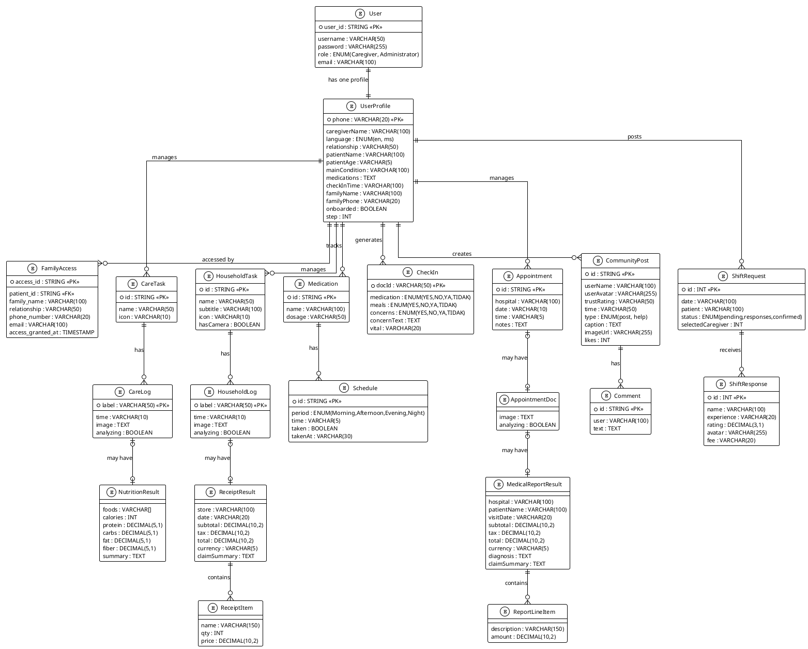

## 3.3 Functional Requirements

**FR1 — Care Task Logging**
The system shall display daily care tasks by category. Caregivers shall mark tasks complete with a tap. Tasks with photographs shall support camera capture or gallery upload.

**FR2 — Medication Tracking**
The system shall support adding medications with dosage and daily schedule. Each dose shall be individually markable as taken with a timestamp recorded. An adherence percentage shall be calculated and displayed.

**FR3 — Appointment Management**
The system shall allow caregivers to create appointments with hospital, date, time, and notes. Medical documents can be attached and automatically analysed to extract structured data.

**FR4 — Grocery and Household Management**
The system shall track cooking, cleaning, and grocery tasks. Receipt scanning shall be available for grocery tasks, with automatic itemised extraction and automatic navigation to the financial report after analysis.

**FR5 — Financial Reporting**
The system shall aggregate grocery and medical receipts into a transaction list with category totals. AI spending analysis shall be available on demand. PDF export shall be supported.

**FR6 — Daily Health Report**
The system shall calculate a daily care score based on task completion, medication adherence, and household task completion. An AI summary shall be available on demand, including a care overview, highlights, meal recommendations with photos, and a caregiving tip.

**FR7 — Automated Notifications**
A daily WhatsApp update shall be sent to the family contact at 8 PM. Separate notifications shall be sent for receipt scans, medication alerts, and new appointments. A monthly expense email shall be sent via Gmail.

---

## 3.4 Non-Functional Requirements

**NFR1 — Usability:** Interface designed for mobile. Primary actions reachable in two taps. Loading states shown for all API calls.

**NFR2 — Performance:** Receipt analysis under 15 seconds. AI summary under 20 seconds.

**NFR3 — Reliability:** API failures shall show an error message without crashing. Locally stored data shall remain accessible if a network call fails.

**NFR4 — Security:** API keys stored as environment variables, not in client code.

**NFR5 — Maintainability:** AI prompts contained in API route handlers, not in frontend components.

---

## 3.5 User Requirements

The system shall be usable by someone with basic smartphone familiarity. All content shall be in plain English without clinical terms. Nothing shall look like medical advice.

---

## 3.6 Summary

Seven functional requirement groups and five non-functional requirements were defined. These were used as evaluation criteria during testing in Chapter 6.

---

# CHAPTER 4: SYSTEM DESIGN

## 4.1 System Overview

The following diagram summarises the four layers and their relationships:

| Layer | Technology | Responsibility |
|---|---|---|
| Client | Next.js 14 (React) | UI rendering, state management, user interaction |
| Server | Next.js API Routes | AI integration, OCR, Firestore sync |
| Data | Firebase Firestore + localStorage | Persistent state storage |
| Automation | n8n | Scheduled and webhook-triggered notifications |

---

## 4.2 System Architecture

The system is organised into four layers: the client layer, the server layer, the data layer, and the automation layer. Each layer has a clearly defined responsibility and communicates with adjacent layers through well-defined interfaces.

```plantuml
@startuml KAI_ArchitectureDiagram
!define RECTANGLE class

skinparam backgroundColor #FAFAFA
skinparam defaultFontName Arial
skinparam defaultFontSize 12

skinparam rectangle {
  BackgroundColor #FFFFFF
  BorderColor #888888
  BorderThickness 1.5
  RoundCorner 10
}

skinparam component {
  BackgroundColor #EEF4FF
  BorderColor #336699
  FontColor #222222
}

skinparam database {
  BackgroundColor #FFF8E1
  BorderColor #F9A825
}

skinparam cloud {
  BackgroundColor #F3E5F5
  BorderColor #7B1FA2
}

skinparam node {
  BackgroundColor #E8F5E9
  BorderColor #2E7D32
}

skinparam arrow {
  Color #555555
  FontSize 10
}

' ── ACTORS ──────────────────────────────────────────
actor "Caregiver" as CG
actor "Family\nMember" as FM

' ── CLIENT LAYER ────────────────────────────────────
rectangle "Client Layer — Next.js 14 (React)" as CLIENT #EEF4FF {
  component "Patient Care\nModule" as MOD1
  component "Medication\nModule" as MOD2
  component "Appointment\nModule" as MOD3
  component "Household &\nReceipt Module" as MOD4
  component "Financial\nModule" as MOD5
  component "Health Report\nModule" as MOD6
  component "localStorage\n(State Cache)" as LS
}

' ── SERVER LAYER ────────────────────────────────────
rectangle "Server Layer — Next.js API Routes" as SERVER #FFF3E0 {
  component "/api/analyze-receipt" as API1
  component "/api/analyze-medical-report" as API2
  component "/api/health-summary" as API3
  component "/api/financial-analysis" as API4
  component "/api/daily-summary" as API5
  component "/api/push-state" as API6
}

' ── DATA LAYER ──────────────────────────────────────
rectangle "Data Layer" as DATA #E8F5E9 {
  database "Firebase\nFirestore" as FS
}

' ── AI SERVICES ─────────────────────────────────────
rectangle "External AI Services" as AI #F3E5F5 {
  cloud "Google Cloud\nVision API\n(OCR)" as GCV
  cloud "Google Gemini AI\n(via Genkit)" as GEM
  cloud "TheMealDB\n(Meal Images)" as MDB
}

' ── AUTOMATION LAYER ────────────────────────────────
rectangle "Automation Layer — n8n" as AUTO #FCE4EC {
  component "Workflow 1\nDaily Summary\n(8 PM cron)" as WF1
  component "Workflow 2\nNew Appointment\n(webhook)" as WF2
  component "Workflow 3\nMonthly Report\n(cron)" as WF3
  component "Workflow 4\nMedication Alert\n(4× daily cron)" as WF4
  component "Workflow 5\nReceipt Scan\n(webhook)" as WF5
}

' ── NOTIFICATION SERVICES ───────────────────────────
rectangle "Notification Services" as NOTIF #FFF8E1 {
  cloud "Twilio\n(WhatsApp)" as TWI
  cloud "Gmail" as GMAIL
}

' ── CONNECTIONS ─────────────────────────────────────
CG --> CLIENT : uses

MOD1 --> LS : read/write
MOD2 --> LS : read/write
MOD3 --> LS : read/write
MOD4 --> LS : read/write
MOD5 --> LS : read/write
MOD6 --> LS : read/write

MOD4 --> API1 : POST image
MOD3 --> API2 : POST document
MOD6 --> API3 : POST state
MOD5 --> API4 : POST transactions
LS   --> API6 : POST state sync
AUTO --> API5 : GET summary

API1 --> GCV : OCR request
API2 --> GCV : OCR request
API1 --> GEM : parse receipt JSON
API2 --> GEM : parse medical JSON
API3 --> GEM : generate summary
API4 --> GEM : analyse spending
API3 --> MDB : fetch meal images

API6 --> FS  : write state
AUTO --> FS  : read state (indirect)

WF1 --> TWI  : WhatsApp message
WF2 --> TWI  : WhatsApp confirmation
WF3 --> GMAIL : HTML expense email
WF3 --> TWI  : WhatsApp confirmation
WF4 --> TWI  : medication alert
WF5 --> TWI  : receipt notification

TWI  --> FM  : WhatsApp
GMAIL --> FM : email

MOD4 ..> WF5 : webhook trigger
MOD3 ..> WF2 : webhook trigger

@enduml
```

**Client Layer** — Next.js 14 with the App Router. Six client-side React modules handle all user interactions. State is written to localStorage immediately and pushed asynchronously to Firestore through `/api/push-state`.

**Server Layer — API Routes**

| Route | Purpose |
|---|---|
| `/api/analyze-receipt` | OCR + Gemini receipt parsing |
| `/api/analyze-medical-report` | OCR + Gemini for medical documents |
| `/api/health-summary` | AI care summary and meal recommendations |
| `/api/financial-analysis` | AI spending analysis |
| `/api/daily-summary` | Structured summary for n8n |
| `/api/push-state` | Write client state to Firestore |

**Data Layer** — Firebase Firestore stores the mirrored application state. localStorage acts as a fast local cache, keeping the UI responsive while the remote sync happens in the background.

**External AI Services** — Google Cloud Vision API performs OCR (DOCUMENT_TEXT_DETECTION mode). Google Gemini AI, orchestrated through Genkit, handles all natural language inference including receipt parsing, medical document extraction, health summaries, and financial analysis. TheMealDB supplies meal images for health report recommendations.

**Automation Layer** — Five n8n workflows run independently of the web application. They are triggered either by cron schedules or by webhooks fired from the client modules. They read data from `/api/daily-summary` and dispatch notifications through Twilio (WhatsApp) and Gmail.

---

## 4.3 Actors

Four actors interact with the system. Three are human and one is an automated system actor.

| Actor | Description |
|---|---|
| Caregiver | Primary user who manages all caregiving tasks including logging daily care activities, recording medications, managing appointments, scanning receipts, viewing financial reports, and generating AI health summaries through the KAI web application |
| Patient | The individual receiving care. The patient does not operate the system directly but is the subject of all caregiving records. Each patient is assigned a unique Patient ID that serves as the shared access key for family members |
| Family Member | Secondary user who enters the patient's unique Patient ID to access a read-only view of the patient's caregiving information, and also receives automated WhatsApp messages and monthly Gmail expense reports |
| n8n Automation Engine | System actor that executes five automated workflows triggered by cron schedules or webhooks, acting as the bridge between the caregiver's data and the family member's communication channels via WhatsApp and Gmail |

---

## 4.4 Data Dictionary

The data dictionary below is derived directly from the TypeScript source code. Every field name, type, and constraint matches what is actually implemented. Entities are grouped by their storage location: browser `localStorage` (mirrored to Firestore collection `kai_app_state`), Firestore collection `users`, Firestore collection `checkins`, and UI-only derived/AI output objects.

---

### 1. User Table

Represents a registered account on the KAI login screen (`app/page.tsx`). The login form accepts a username and password before routing the user into the application.

| Attribute Name | Data Type | Description |
|---|---|---|
| user_id | STRING (PK) | Unique system-generated identifier for each user account |
| username | VARCHAR(50) | Login username entered on the login screen. Must be unique |
| password | VARCHAR(255) | Encrypted password used to authenticate the user at login |
| role | ENUM (Caregiver, Administrator) | Access role. Caregiver uses all care modules; Administrator manages user accounts and system settings |
| email | VARCHAR(100) | Email address used for account recovery and monthly expense report delivery |

---

### 2. UserProfile Table

Stored in Firestore collection `users`, document ID is the caregiver's WhatsApp phone number. Created during the 9-step WhatsApp onboarding flow (`whatsapp/onboarding.ts`). Also contains session-state fields used by the WhatsApp bot to track conversation progress.

| Attribute Name | Data Type | Description |
|---|---|---|
| phone | VARCHAR(20) (PK) | Caregiver's WhatsApp number, used as the Firestore document ID (e.g., +60123456789) |
| onboarded | BOOLEAN | Whether the caregiver has completed the full onboarding flow. Default false |
| step | INT | Current onboarding step the user is on (1–10). Used by the bot to know what to ask next |
| language | ENUM (en, ms) \| NULL | Preferred language selected in Step 1. "en" for English, "ms" for Bahasa Malaysia |
| caregiverName | VARCHAR(100) \| NULL | Name of the caregiver entered in Step 2 |
| relationship | VARCHAR(50) \| NULL | Caregiver's relationship to the patient selected in Step 3 (Parent, Spouse, Grandparent, Other) |
| patientName | VARCHAR(100) \| NULL | Name of the patient entered in Step 4 |
| patientAge | VARCHAR(5) \| NULL | Age of the patient entered in Step 5 |
| mainCondition | VARCHAR(100) \| NULL | Primary health condition selected in Step 6 (Diabetes, Hypertension, Stroke recovery, Dementia, Other) |
| medications | TEXT \| NULL | Free-text list of current medications entered in Step 7. Empty string if none |
| checkInTime | VARCHAR(100) \| NULL | Preferred daily check-in time(s) entered in Step 8 (e.g., "9am and 6pm") |
| familyName | VARCHAR(100) \| NULL | Emergency contact name entered in Step 9. Null if skipped |
| familyPhone | VARCHAR(20) \| NULL | Emergency contact WhatsApp number entered in Step 10. Null if skipped |
| checkinActive | BOOLEAN \| NULL | True when a daily check-in conversation is currently in progress via WhatsApp |
| checkinStep | INT \| NULL | Which check-in question the bot is currently on (0 = medication, 1 = meals, 2 = concerns) |
| checkinDate | VARCHAR(10) \| NULL | ISO date string (YYYY-MM-DD) of when the current check-in session started |
| awaitingConcernDetail | BOOLEAN \| NULL | True when the bot is waiting for the caregiver to describe a concern after answering YES |
| awaitingEscalationChoice | BOOLEAN \| NULL | True when the bot has offered escalation options (reminder / notify family / teleconsult) and is waiting for a reply |
| awaitingVital | BOOLEAN \| NULL | True when the bot has asked the caregiver to enter a vital sign reading |
| awaitingWellnessResponse | BOOLEAN \| NULL | True when the bot is waiting for a response to a wellness check message |
| lastWellnessCheck | VARCHAR(10) \| NULL | ISO date string of the last date a wellness check was sent to this caregiver |

---

### 3. CareTask Table

Stored under localStorage key `kai_care_tasks` and mirrored to Firestore. Represents a recurring daily patient care activity. The three default tasks are Bathing, Dressing, and Feeding.

| Attribute Name | Data Type | Description |
|---|---|---|
| id | STRING (PK) | Fixed task identifier (e.g., "bathing", "dressing", "feeding") |
| name | VARCHAR(50) | Display name shown in the UI (e.g., "Bathing", "Dressing", "Feeding") |
| icon | VARCHAR(10) | Emoji icon displayed alongside the task name (e.g., 🛁, 👕, 🥣) |
| logs | CareLog[] | Array of log entries appended each time the caregiver completes this task |

---

### 4. CareLog Table

Nested inside CareTask.logs. Represents one completion instance. For the Feeding task, optionally stores a meal photo and AI nutrition estimate.

| Attribute Name | Data Type | Description |
|---|---|---|
| label | VARCHAR(50) | Sequential completion label (e.g., "First check in", "Second check in") |
| time | VARCHAR(10) | Local time string when the log was created (e.g., "09:30 AM") |
| image | TEXT \| NULL | Base64-encoded JPEG data URL of the meal photo. Present only for Feeding task logs |
| nutrition | NutritionResult \| NULL | AI nutrition estimate from `/api/analyze-meal`. Null until analysis completes or for non-feeding tasks |
| analyzing | BOOLEAN \| NULL | True while the nutrition analysis API call is in progress. Absent after completion |

---

### 5. NutritionResult Table

AI output nested inside CareLog.nutrition. Returned by `/api/analyze-meal` using Google Cloud Vision label detection and Gemini inference. Not stored independently.

| Attribute Name | Data Type | Description |
|---|---|---|
| foods | VARCHAR[] | List of food items identified in the meal photo by the AI |
| calories | INT | Estimated total calorie count of the meal in kilocalories (kcal) |
| protein | DECIMAL(5,1) | Estimated protein content in grams |
| carbs | DECIMAL(5,1) | Estimated carbohydrate content in grams |
| fat | DECIMAL(5,1) | Estimated fat content in grams |
| fiber | DECIMAL(5,1) | Estimated dietary fibre content in grams |
| summary | TEXT | Short plain-English description of the meal and its nutritional profile generated by Gemini |

---

### 6. HouseholdTask Table

Stored under localStorage key `kai_household_tasks`. Represents a recurring household responsibility. The three default tasks are Cooking Meal, Cleaning Room, and Managing Groceries.

| Attribute Name | Data Type | Description |
|---|---|---|
| id | STRING (PK) | Fixed task identifier (e.g., "cooking", "cleaning", "groceries") |
| name | VARCHAR(50) | Display name shown in the UI (e.g., "Cooking Meal", "Managing Groceries") |
| subtitle | VARCHAR(100) | Short instruction hint shown beneath the task name in the UI |
| icon | VARCHAR(10) | Emoji icon displayed alongside the task name (e.g., 🍳, 🧹, 🛒) |
| logs | HouseholdLog[] | Array of log entries appended each time the task is completed |
| hasCamera | BOOLEAN | Whether this task supports photo or receipt capture. True for Cooking and Groceries |

---

### 7. HouseholdLog Table

Nested inside HouseholdTask.logs. For the Groceries task, additionally stores scanned receipt data returned by the AI pipeline.

| Attribute Name | Data Type | Description |
|---|---|---|
| label | VARCHAR(50) | Sequential completion label (e.g., "First check in", "Second check in") |
| time | VARCHAR(10) | Local time string when the log was created |
| image | TEXT \| NULL | Base64-encoded JPEG data URL of the captured photo. Present for Cooking and Groceries logs |
| receipt | ReceiptResult \| NULL | Structured receipt data from `/api/analyze-receipt`. Populated only for Groceries logs after a successful scan |
| analyzing | BOOLEAN \| NULL | True while the receipt analysis API call is in progress |

---

### 8. ReceiptResult Table

AI output nested inside HouseholdLog.receipt. Produced by `/api/analyze-receipt` using Google Cloud Vision DOCUMENT_TEXT_DETECTION and Gemini parsing.

| Attribute Name | Data Type | Description |
|---|---|---|
| store | VARCHAR(100) | Store or merchant name extracted from the receipt. Returns "Unknown Store" if undetectable |
| date | VARCHAR(20) | Purchase date as printed on the receipt |
| items | ReceiptItem[] | Array of individual purchased line items extracted from the receipt |
| subtotal | DECIMAL(10,2) | Pre-tax subtotal extracted from the receipt in MYR |
| tax | DECIMAL(10,2) | Tax amount extracted from the receipt in MYR. Returns 0 if no tax line found |
| total | DECIMAL(10,2) | Final total amount paid as printed on the receipt in MYR |
| currency | VARCHAR(5) | Currency code. Defaults to "MYR" |
| claimSummary | TEXT | One-sentence formal claim note generated by Gemini suitable for family reimbursement |

---

### 9. ReceiptItem Table

Nested inside ReceiptResult.items. Represents one purchased line item extracted from a grocery receipt.

| Attribute Name | Data Type | Description |
|---|---|---|
| name | VARCHAR(150) | Item name as printed on the receipt |
| qty | INT \| NULL | Quantity purchased. Optional — not all receipts print quantity separately |
| price | DECIMAL(10,2) | Price of the item as printed on the receipt in MYR |

---

### 10. Medication Table

Stored under localStorage key `kai_medications`. Represents a medication prescribed to the patient.

| Attribute Name | Data Type | Description |
|---|---|---|
| id | STRING (PK) | Unique identifier generated via `Math.random().toString(36).slice(2)` |
| name | VARCHAR(100) | Medication name as entered by the caregiver (e.g., Metformin, Amlodipine) |
| dosage | VARCHAR(50) | Dosage as entered by the caregiver (e.g., 500mg, 5mg, 1 tablet) |
| schedules | Schedule[] | Array of Schedule entries, one per dose period assigned to this medication |

---

### 11. Schedule Table

Nested inside Medication.schedules. Represents one dose period. Multiple Schedule records exist per Medication, one per time of day.

| Attribute Name | Data Type | Description |
|---|---|---|
| id | STRING (PK) | Unique identifier generated via `Math.random().toString(36).slice(2)` |
| period | ENUM (Morning, Afternoon, Evening, Night) | Named dose period. Default times: Morning 08:00, Afternoon 13:00, Evening 18:00, Night 21:00 |
| time | VARCHAR(5) | Scheduled dose time in HH:MM (24-hour) format, editable by the caregiver |
| taken | BOOLEAN | Whether this dose has been marked as taken. Default false |
| takenAt | VARCHAR(30) \| NULL | Locale datetime string when the dose was marked taken. Null if not yet administered |

---

### 12. Appointment Table

Stored under localStorage key `kai_appointments`. Represents a scheduled medical appointment.

| Attribute Name | Data Type | Description |
|---|---|---|
| id | STRING (PK) | Unique identifier generated via `Math.random().toString(36).slice(2)` |
| hospital | VARCHAR(100) | Name of the hospital or clinic |
| date | VARCHAR(10) | Appointment date in YYYY-MM-DD format as selected from a date picker |
| time | VARCHAR(5) | Appointment time in HH:MM (24-hour) format. Defaults to "09:00" |
| notes | TEXT | Free-text notes entered by the caregiver. Empty string if none provided |
| doc | AppointmentDoc \| NULL | Attached medical document object. Null if no document uploaded |

---

### 13. AppointmentDoc Table

Nested inside Appointment.doc. Stores the raw document image and its AI analysis result.

| Attribute Name | Data Type | Description |
|---|---|---|
| image | TEXT | Base64-encoded JPEG or PNG data URL of the uploaded medical document |
| report | MedicalReportResult \| NULL | Structured data extracted by `/api/analyze-medical-report`. Null until analysis completes |
| analyzing | BOOLEAN | True while the document analysis API call is in progress |

---

### 14. MedicalReportResult Table

AI output nested inside AppointmentDoc.report. Produced by `/api/analyze-medical-report` using Google Cloud Vision OCR and Gemini.

| Attribute Name | Data Type | Description |
|---|---|---|
| hospital | VARCHAR(100) | Hospital or clinic name extracted from the medical document |
| patientName | VARCHAR(100) | Patient name as printed on the medical document |
| visitDate | VARCHAR(20) | Visit or report date as extracted from the document |
| items | ReportLineItem[] | Array of billable or clinical line items extracted from the document |
| subtotal | DECIMAL(10,2) | Pre-tax subtotal extracted from the medical bill in MYR |
| tax | DECIMAL(10,2) | Tax amount extracted from the bill in MYR. Returns 0 if absent |
| total | DECIMAL(10,2) | Total amount due as printed on the bill in MYR |
| currency | VARCHAR(5) | Currency code. Defaults to "MYR" |
| diagnosis | TEXT | Diagnosis or clinical summary extracted from the document |
| claimSummary | TEXT | Formal one-sentence claim note generated by Gemini for family reimbursement |

---

### 15. ReportLineItem Table

Nested inside MedicalReportResult.items. Represents one billable item from a medical document.

| Attribute Name | Data Type | Description |
|---|---|---|
| description | VARCHAR(150) | Label of the line item (e.g., Consultation Fee, Blood Test, X-Ray) |
| amount | DECIMAL(10,2) | Amount charged for this item in MYR |

---

### 16. CheckIn Table

Stored in Firestore collection `checkins`. Document ID format: `{phone}_{date}` (e.g., `+60123456789_2026-05-31`). Created and updated by the WhatsApp daily check-in bot during each conversation session.

| Attribute Name | Data Type | Description |
|---|---|---|
| medication | ENUM (YES, NO, YA, TIDAK) \| NULL | Caregiver's response to whether the patient took their medication today |
| meals | ENUM (YES, NO, YA, TIDAK) \| NULL | Caregiver's response to whether the patient ate their meals today |
| concerns | ENUM (YES, NO, YA, TIDAK) \| NULL | Caregiver's response to whether there are any concerns about the patient today |
| concernText | TEXT \| NULL | Free-text description of the concern entered after answering YES. Maximum 500 characters |
| vital | VARCHAR(20) \| NULL | Vital sign reading entered by the caregiver (e.g., "120/80", "6.5"). Null if skipped |

---

### 17. CommunityPost Table

Used in the Community module (`app/community/page.tsx`). Represents a post or help request shared in the caregiver community feed.

| Attribute Name | Data Type | Description |
|---|---|---|
| id | STRING (PK) | Unique identifier for the post |
| user.name | VARCHAR(100) | Display name of the user who created the post |
| user.avatar | VARCHAR(255) | File path or URL of the user's profile avatar image |
| user.trustRating | VARCHAR(50) \| NULL | Optional trust rating string shown for verified caregivers (e.g., "⭐ 4.9 (120 Shifts)") |
| time | VARCHAR(50) | Human-readable relative timestamp (e.g., "2 hours ago", "1 day ago") |
| type | ENUM (post, help) \| NULL | Post type. "post" for general updates, "help" for shift request posts |
| helpDetails.date | VARCHAR(50) \| NULL | Shift date and time range for help requests (e.g., "Today, 8:00 PM - 2:00 AM") |
| helpDetails.location | VARCHAR(100) \| NULL | Location of the required caregiving shift |
| helpDetails.patientAge | VARCHAR(10) \| NULL | Age of the patient needing care for this shift |
| helpDetails.condition | VARCHAR(100) \| NULL | Patient's health condition relevant to the shift |
| imageUrl | VARCHAR(255) \| NULL | File path or URL of the post image. Optional |
| caption | TEXT | Main text body of the post |
| likes | INT | Total number of likes the post has received |
| comments | Comment[] | Array of comment entries on this post |

---

### 18. Comment Table

Nested inside CommunityPost.comments. Represents one comment on a community post.

| Attribute Name | Data Type | Description |
|---|---|---|
| id | STRING (PK) | Unique identifier for the comment |
| user | VARCHAR(100) | Display name of the user who wrote the comment |
| text | TEXT | Text content of the comment |

---

### 19. ShiftRequest Table

Used in the Home dashboard (`app/home/page.tsx`). Represents a caregiver shift request posted by the user seeking help for their patient.

| Attribute Name | Data Type | Description |
|---|---|---|
| id | INT (PK) | Unique numeric identifier for the shift request |
| date | VARCHAR(100) | Human-readable date and time range of the requested shift (e.g., "Today, 8:00 PM - 2:00 AM") |
| patient | VARCHAR(100) | Name of the patient requiring care during the shift |
| status | ENUM (responses, pending, confirmed) | Current status: "pending" means no responses yet; "responses" means caregivers have applied; "confirmed" means one is selected |
| responses | ShiftResponse[] | Array of caregiver responses who have applied for this shift |
| selectedCaregiver | INT \| NULL | ID of the ShiftResponse selected by the user. Null until confirmed |

---

### 20. ShiftResponse Table

Nested inside ShiftRequest.responses. Represents one caregiver who has applied for a shift.

| Attribute Name | Data Type | Description |
|---|---|---|
| id | INT (PK) | Unique numeric identifier for this caregiver response |
| name | VARCHAR(100) | Name of the caregiver who applied |
| experience | VARCHAR(20) | Years of experience (e.g., "5 yrs", "8 yrs") |
| rating | DECIMAL(3,1) | Star rating of the caregiver (e.g., 4.9, 5.0) |
| avatar | VARCHAR(255) | File path or URL of the caregiver's profile avatar |
| fee | VARCHAR(20) | Hourly fee quoted by the caregiver (e.g., "$25/hr") |

---

### 21. FamilyAccess Table

Represents the access record created when a family member enters a patient ID to view the patient's caregiving information in read-only mode.

| Attribute Name | Data Type | Description |
|---|---|---|
| access_id | STRING (PK) | Unique identifier auto-generated for each family access record |
| patient_id | STRING (FK) | References the Patient whose data the family member is viewing |
| family_name | VARCHAR(100) | Full name of the family member granted access |
| relationship | VARCHAR(50) | Relationship to the patient (e.g., Son, Daughter, Spouse, Sibling) |
| phone_number | VARCHAR(20) | WhatsApp number used for automated notification delivery |
| email | VARCHAR(100) \| NULL | Email address for monthly expense report delivery. Optional |
| access_granted_at | TIMESTAMP | Date and time the family member first entered the patient ID |

---

### 22. Transaction Table (Derived — Not Stored)

Built at runtime in `app/financial/page.tsx` from `kai_household_tasks` (grocery receipts) and `kai_appointments` (medical bills). Not persisted to localStorage or Firestore.

| Attribute Name | Data Type | Description |
|---|---|---|
| id | STRING | Derived ID (e.g., "grocery-0", "medical-1") from source array index |
| title | VARCHAR(100) | Store name for grocery transactions or hospital name for medical transactions |
| date | VARCHAR(20) | Date from the source ReceiptResult or Appointment |
| amount | DECIMAL(10,2) | Total transaction amount in MYR |
| currency | VARCHAR(5) | Currency code from the source receipt or bill. Defaults to "MYR" |
| category | ENUM (groceries, medical) | Source of the transaction |
| items | TransactionItem[] | Line items with label and amount, derived from ReceiptItem or ReportLineItem |
| claimNote | TEXT | Claim summary passed through from ReceiptResult.claimSummary or MedicalReportResult.claimSummary |

---

### 23. DailySummary Table (Derived — Not Stored)

Returned by GET `/api/daily-summary`. Read by n8n Workflow 1 to compose the daily WhatsApp message. Assembled from the four localStorage keys stored in Firestore.

| Attribute Name | Data Type | Description |
|---|---|---|
| date | VARCHAR(10) | Current date in YYYY-MM-DD format |
| score | INT | Overall daily care score (0–100). Weighted: 40% care tasks + 40% medication + 20% household |
| care.completed | INT | Number of care tasks that have at least one log entry today |
| care.total | INT | Total number of care tasks defined |
| care.tasks | Object[] | Array of { name, icon, done (boolean), logs (count) } per task |
| medication.taken | INT | Number of medication doses marked as taken today |
| medication.total | INT | Total number of medication doses scheduled for today |
| medication.pending | Object[] | Array of { name, dosage, period, time } for doses not yet taken |
| appointments.upcoming | Object[] | Up to 3 upcoming appointments as { hospital, date, time, notes } sorted by date |
| household.completed | INT | Number of household tasks with at least one log entry today |
| household.total | INT | Total number of household tasks defined |

---

### 24. HealthSummaryResult Table (AI Output — Not Stored)

Returned by POST `/api/health-summary` on demand. Generated by Gemini via Genkit. Not persisted.

| Attribute Name | Data Type | Description |
|---|---|---|
| overallStatus | ENUM (Good, Fair, Needs Attention) | Top-level status label based on the day's activity |
| score | INT | Numeric care score 0–100 |
| summary | TEXT | 2–3 sentence narrative of the patient's day written in plain English |
| highlights | VARCHAR[] | Short bullet-point highlights from the day's caregiving activity |
| recommendation | TEXT | One caregiving tip written in a warm, non-clinical tone |
| meals | MealRecommendation[] | Array of three meal suggestions |

---

### 25. MealRecommendation Table (AI Output — Not Stored)

Nested inside HealthSummaryResult.meals. Image fetched from TheMealDB; Unsplash fallback used if no match found.

| Attribute Name | Data Type | Description |
|---|---|---|
| name | VARCHAR(100) | English meal name used to query TheMealDB API |
| description | VARCHAR(200) | Short description of the meal written by Gemini |
| why | TEXT | Reason this meal is appropriate for the patient given the day's caregiving context |
| imageUrl | TEXT | Full URL from TheMealDB (`/preview`) or one of three Unsplash fallback photo URLs |

---

### 26. FinancialAnalysisResult Table (AI Output — Not Stored)

Returned by POST `/api/financial-analysis` on demand. Generated by Gemini. Not persisted.

| Attribute Name | Data Type | Description |
|---|---|---|
| insight | TEXT | 2–3 warm, conversational sentences summarising overall spending patterns |
| topCategory | VARCHAR(50) | Spending category with the highest total ("Groceries" or "Medical") |
| groceriesTip | TEXT | Practical suggestion for managing grocery spending |
| medicalTip | TEXT | Practical suggestion for managing medical expenses |
| claimNote | TEXT | Formal summary note suitable for family reimbursement claim submission |

---

### 27. PatternSummary Table (Derived — Not Stored)

Computed in `whatsapp/memory.ts` by reading the last 7 days of CheckIn documents from Firestore. Used to trigger escalation alerts and weekly summaries via WhatsApp.

| Attribute Name | Data Type | Description |
|---|---|---|
| missedMedication | INT | Count of days in the past 7 where medication response was NO or TIDAK |
| skippedMeals | INT | Count of days in the past 7 where meals response was NO or TIDAK |
| raisedConcerns | INT | Count of days in the past 7 where concerns response was YES or YA |

## 4.6 Activity Diagram

**Receipt Scanning**

Caregiver photographs a receipt → image sent to `/api/analyze-receipt` → Cloud Vision extracts text → Gemini parses text into structured JSON → result stored in task log → app navigates to financial report → n8n webhook sends WhatsApp notification to family.

**AI Care Summary**

Caregiver taps Generate → current state read from localStorage → sent to `/api/health-summary` → Gemini returns summary JSON with meal names → TheMealDB images fetched per meal → response rendered in health report.

---

## 4.7 Sequence Diagram

**Receipt Analysis**

1. Caregiver captures or uploads receipt image
2. Client encodes to base64, sets `analyzing: true` in task log
3. POST to `/api/analyze-receipt`
4. API calls Google Cloud Vision (DOCUMENT_TEXT_DETECTION)
5. Cloud Vision returns OCR text
6. API sends text + JSON schema to Gemini
7. Gemini returns structured receipt data
8. Client updates task log, sets `analyzing: false`
9. State saved to localStorage and Firestore
10. App navigates to `/financial`
11. Webhook fires to n8n Workflow 5
12. n8n sends WhatsApp notification

---

## 4.8 Entity-Relationship Diagram

The ERD below shows all entities, their key attributes, and the relationships between them. Entities are grouped into five domains: Authentication, Care Management, Medication, Appointment, and Community.

**Relationship Summary**

| Relationship | Cardinality | Description |
|---|---|---|
| User — UserProfile | 1 to 1 | Each user account has exactly one caregiving profile |
| UserProfile — FamilyAccess | 1 to many | A patient's profile can be accessed by multiple family members |
| UserProfile — CheckIn | 1 to many | A caregiver generates one check-in document per day |
| UserProfile — CareTask | 1 to many | A caregiver manages multiple daily care tasks |
| CareTask — CareLog | 1 to many | Each task accumulates multiple completion log entries |
| CareLog — NutritionResult | 1 to zero-or-one | Only Feeding logs may carry one nutrition analysis result |
| UserProfile — HouseholdTask | 1 to many | A caregiver manages multiple household tasks |
| HouseholdTask — HouseholdLog | 1 to many | Each household task accumulates multiple completion logs |
| HouseholdLog — ReceiptResult | 1 to zero-or-one | Only Groceries logs may carry one scanned receipt |
| ReceiptResult — ReceiptItem | 1 to many | A receipt contains multiple purchased line items |
| UserProfile — Medication | 1 to many | A caregiver tracks multiple medications for the patient |
| Medication — Schedule | 1 to many | Each medication has multiple dose schedules per day |
| UserProfile — Appointment | 1 to many | A caregiver manages multiple medical appointments |
| Appointment — AppointmentDoc | 1 to zero-or-one | An appointment may optionally have one attached document |
| AppointmentDoc — MedicalReportResult | 1 to zero-or-one | A document may have one AI-extracted report result |
| MedicalReportResult — ReportLineItem | 1 to many | A medical report contains multiple billable line items |
| UserProfile — CommunityPost | 1 to many | A caregiver can create multiple community posts |
| CommunityPost — Comment | 1 to many | A post can receive multiple comments |
| UserProfile — ShiftRequest | 1 to many | A caregiver can post multiple shift requests |
| ShiftRequest — ShiftResponse | 1 to many | A shift request can receive multiple caregiver responses |

---

## 4.9 Interface Design

The app uses a dark theme with glass-morphism cards throughout. Each module has its own colour — yellow-gold for household management, emerald green for financial and health sections.

All pages render inside a simulated iPhone 13 frame. This decision was made early so the layout would always be designed for a phone screen, not adapted to it later.

Navigation uses a dock at the bottom for main sections and a back button in the header for sub-pages. The three design principles were: fewer taps for common actions, visible feedback for every async operation, and no unexplained waiting.

---

## 4.10 Summary

The three-tier architecture with a separate automation layer keeps the web application and the notification system loosely coupled. Each can operate independently as long as Firestore stays in sync.

---

# CHAPTER 5: IMPLEMENTATION

## 5.1 Overview

This chapter covers the development environment, each module, the AI features, and the automation workflows.

---

## 5.2 Development Environment

| Tool | Version | Purpose |
|---|---|---|
| Node.js | 20.x LTS | Runtime |
| Next.js | 14.x | Frontend and API routes |
| TypeScript | 5.x | Type safety |
| Tailwind CSS | 3.x | Styling |
| Firebase Admin SDK | 13.x | Firestore access |
| Google Genkit | 1.32.x | Gemini orchestration |
| jsPDF | 2.x | PDF export |
| n8n | Community edition | Automation |

The app runs on port 3000 via `npm run dev`. n8n is started with `bash start-n8n.sh`, which sets environment variables before launching the process.

---

## 5.3 Core Modules

### 5.3.1 Patient Care

`app/patient_caring/page.tsx`. Tasks are stored as `CareTask` objects with a logs array. Completing a task appends a log entry with a timestamp and optional photo. State saves to localStorage and pushes to Firestore.

### 5.3.2 Medication

`app/medication/page.tsx`. Medications are added with a name, dosage, and schedule periods. Each period is a `MedSchedule` with a taken flag and timestamp. Adherence is `(taken / total) * 100`.

### 5.3.3 Appointments

`app/appointment/page.tsx`. Appointments store hospital, date, time, and notes. Attached documents go through the same OCR-Gemini pipeline as receipts, using `/api/analyze-medical-report`.

### 5.3.4 Household Management and Receipt Scanning

`app/household_management/page.tsx`. This was the most complex module to build.

When a receipt image is submitted, `analyzeReceipt` calls `/api/analyze-receipt`. The route authenticates with Cloud Vision using `google-auth-library`, runs DOCUMENT_TEXT_DETECTION, then sends the text to Gemini with a JSON schema prompt.

One specific decision worth explaining: after analysis, the app calls `save()` directly inside the `setTasks` updater rather than waiting for the useEffect. This is because `router.push('/financial')` fires immediately after, and the useEffect might not have run yet. If the save is delayed, the financial page loads before the receipt data is in localStorage and the transaction appears missing.

### 5.3.5 Financial Module

`app/financial/page.tsx`. Reads localStorage, extracts receipts from grocery logs and medical data from appointments, and builds a sorted `Transaction[]` array. PDF export is done client-side with jsPDF.

### 5.3.6 Health Report

`app/report/page.tsx`. Care score formula: 40% care tasks + 40% medication + 20% household. The weighting reflects that medication and care tasks matter more to patient health than household tasks, though the formula is simple and does not claim to be clinically validated.

---

## 5.4 AI Features

### 5.4.1 Receipt Parsing

`/api/analyze-receipt`. Cloud Vision is called via REST, authenticated with a service account token. DOCUMENT_TEXT_DETECTION was chosen over standard TEXT_DETECTION because it handles dense, structured text better.

The Gemini prompt specifies an exact JSON schema and includes fallback rules — for example, unknown stores should return "Unknown Store" rather than null, and prices should be numbers not strings. Several prompt iterations were needed before the output was reliable across different receipt formats.

### 5.4.2 Health Summary and Meals

`/api/health-summary`. Uses Genkit with `googleai/gemini-2.5-flash`. The prompt explicitly prohibits clinical language and medication references. Meal names are returned in English so they can be matched against TheMealDB. For each meal, the route fetches the image from `https://www.themealdb.com/api/json/v1/1/search.php?s={name}`. If no match is found — common with Malaysian dishes — one of three Unsplash food photos is used as fallback.

### 5.4.3 Financial Analysis

`/api/financial-analysis`. Receives the transaction list and returns a four-field JSON: overall insight, grocery tip, medical tip, and a claim note written in formal language suitable for a family reimbursement submission.

---

## 5.5 Automation Workflows

Five workflows are stored as JSON in the `n8n/` folder.

**Workflow 1:** Daily schedule at 8 PM → fetch `/api/daily-summary` → format message → WhatsApp to family.

**Workflow 2:** Webhook on new appointment → create Google Calendar event → WhatsApp confirmation.

**Workflow 3:** Last day of month at 9 AM → fetch `/api/financial-export` → build HTML email → Gmail → WhatsApp confirmation.

**Workflow 4:** Four times daily → check medication status → if overdue doses exist, send WhatsApp alert.

**Workflow 5:** Webhook after receipt scan → send WhatsApp with store name and total.

---

## 5.6 Summary

All six modules, three AI integrations, and five automation workflows were implemented. The receipt parsing pipeline required the most iteration — getting Gemini to produce consistent JSON across different receipt layouts took several prompt revisions.

---

# CHAPTER 6: TESTING

## 6.1 Overview

Testing was done at three levels: unit, integration, and system. All tests were verified against the functional requirements from Chapter 3.

---

## 6.2 Unit Testing

**UT-01 — Receipt Analysis, Clear Image**
Input: Clear photo of a Malaysian grocery receipt.
Expected: ReceiptResult with store, items, total, MYR currency.
Result: Pass. All fields correctly populated.

**UT-02 — Receipt Analysis, Blurry Image**
Input: Partially blurred receipt.
Expected: Partial result with available fields populated.
Result: Pass. Store name was empty, item count reduced, but total was still found. No errors thrown.

**UT-03 — Health Summary**
Input: Three completed tasks, two medications (one taken), one appointment.
Expected: HealthSummaryResult with status, score, summary, highlights, tip, and three meals with images.
Result: Pass. Two meals found in TheMealDB, one used Unsplash fallback.

**UT-04 — Financial Analysis**
Input: Two grocery and one medical transaction.
Expected: Insight, groceriesTip, medicalTip, claimNote.
Result: Pass. All fields present. ClaimNote was appropriately formal.

**UT-05 — Daily Summary API**
Input: Firestore data under test keys.
Expected: Structured summary with care score.
Result: Pass.

---

## 6.3 Integration Testing

**IT-01 — Receipt to Financial Report**
After uploading a receipt, the financial page should load and show the new transaction.
Result: Pass. Navigation happened within two seconds. Transaction appeared correctly.

**IT-02 — Medication in Health Report**
After adding two medications and marking one taken, health report should show 50% adherence and the pending dose.
Result: Pass.

**IT-03 — Push-State to Firestore**
After completing a task, Firestore should update within a few seconds.
Result: Pass. n8n daily summary workflow read the updated data successfully.

**IT-04 — n8n Daily Summary Workflow**
Manual trigger in n8n should send a WhatsApp message with correct content.
Result: Pass. Message arrived within three seconds.

---

## 6.4 System Testing

**ST-01 — Full Receipt Scan**
Upload receipt → analysing spinner → itemised breakdown in task log → navigate to financial report.
Result: Pass. Completed in about 9 seconds.

**ST-02 — AI Care Summary**
Tap Generate → status badge, summary, highlights, meal cards with photos, tip all appear.
Result: Pass. Generated in about 13 seconds.

**ST-03 — PDF Export**
Tap Export PDF → file downloads with transactions, AI analysis, and footer.
Result: Pass.

**ST-04 — Back Navigation**
Tap back button on health report → navigate to home.
Result: Pass.

---

## 6.5 Requirements Traceability

| Requirement | Test Cases | Status |
|---|---|---|
| FR1 — Care Task Logging | IT-02, ST-02 | Met |
| FR2 — Medication Tracking | UT-03, IT-02 | Met |
| FR3 — Appointment Management | IT-02 | Met |
| FR4 — Receipt Scanning | UT-01, UT-02, IT-01, ST-01 | Met |
| FR5 — Financial Reporting | UT-04, IT-01, ST-03 | Met |
| FR6 — Health Report | UT-03, IT-02, ST-02 | Met |
| FR7 — Automated Notifications | IT-03, IT-04 | Met |

---

## 6.6 Summary

All requirements were met. Receipt analysis and AI summaries both completed within the performance thresholds. The push-state synchronisation kept Firestore data current enough for the automation layer to work reliably.

---

# CHAPTER 7: CONCLUSION

## 7.1 What Was Achieved

All six objectives were met in the delivered prototype.

The system consolidates care task logging, medication tracking, appointments, receipt scanning, financial reporting, and a daily AI health summary into one mobile interface. Receipt scanning produces reliable structured data from phone photos. The health summary generates readable, non-clinical overviews with meal suggestions. The n8n layer delivers family notifications automatically.

The system is not clinically validated. But it does what it set out to do — make the day-to-day administrative side of caregiving less manual.

---

## 7.2 Limitations

The localStorage dependency is the biggest practical gap. Data is tied to one browser on one device. There is no account system. This was a deliberate scope decision but it is the most obvious thing that would need to change before the system could be used in a real household.

The Twilio sandbox requires manual opt-in from recipients. That works for testing but not for actual deployment.

The AI features also depend on external APIs that could change pricing or availability. That is a dependency worth noting for any future deployment plan.

---

## 7.3 Future Work

The highest priority next step is user authentication with cloud-based data storage. That alone would address most of the portability limitations.

A WhatsApp-based conversational interface would also extend the system's reach to caregivers who are not comfortable using a web app, or who need information quickly without opening a browser.

On the AI side, summaries could be more useful if they tracked patterns over multiple days rather than just reporting on today. A caregiver with three missed doses this week should receive a different kind of feedback than one with a clean record.

A formal usability study with actual caregivers would also be valuable. The current testing confirmed the system works technically, but feedback from real users would reveal usability problems that developer testing cannot.

---

## 7.4 Closing Remarks

Managing elderly care at home involves a lot of small, invisible administrative work. This project aimed to reduce some of that. The result is a prototype that tracks tasks, monitors medications, converts receipts into records, and keeps family members informed — without the caregiver having to do most of it manually.

It is not a finished product. But it proves the approach works.

---

# REFERENCES

Bates, D. W., Landman, A., & Levine, D. M. (2020). Health apps and health policy: What is needed? *JAMA*, 323(23), 2381–2382.

Choo, W. Y., Low, W. Y., Karina, R., Poi, P. J. H., Ebenezer, E., & Prince, M. J. (2022). Social support and burden among caregivers of persons with dementia in Malaysia. *Asia-Pacific Journal of Public Health*, 15(1), 23–29.

Department of Statistics Malaysia. (2023). *Current population estimates, Malaysia 2023*. DOSM.

Huang, Y., Li, Y., & Xu, W. (2022). Combining OCR and large language models for structured information extraction from receipts. *Proceedings of the International Conference on Document Analysis and Recognition*, 141–150.

Mao, A., Chen, Y., & Martin, J. (2021). Mobile applications for informal caregivers of older adults: A systematic review. *Computers in Human Behavior*, 112, 106483.

Mynatt, E. D., Melenhorst, A. S., Fisk, A. D., & Rogers, W. A. (2020). Aware technologies for aging in place. *IEEE Pervasive Computing*, 3(2), 36–41.

Pew, R. W., & Mavor, A. S. (Eds.). (2020). *Technology for adaptive aging*. National Academies Press.

Samsuddin, S., Ramli, N., & Yahaya, A. (2020). Filial piety and caregiving burden among family caregivers in Malaysia. *Asian Social Science*, 16(4), 1–10.

Schulz, R., & Eden, J. (Eds.). (2016). *Families caring for an aging America*. National Academies Press.

Singhal, K., Azizi, S., Tu, T., Mahdavi, S. S., Wei, J., Chung, H. W., Scales, N., Tanwani, A., Cole-Lewis, H., Pfohl, S., Payne, P., Seneviratne, M., Gamble, P., Kelly, C., Babiker, A., Schärli, N., Chowdhery, A., Mansfield, P., Demner-Fushman, D., … Natarajan, V. (2023). Large language models encode clinical knowledge. *Nature*, 620, 172–180.

Topol, E. J. (2019). High-performance medicine: The convergence of human and artificial intelligence. *Nature Medicine*, 25(1), 44–56.

Zhang, R., Liu, Y., & Chen, H. (2021). Benchmarking cloud OCR services for printed receipt text extraction. *Journal of Imaging Science and Technology*, 65(3), 030401.

---

*End of Report*
