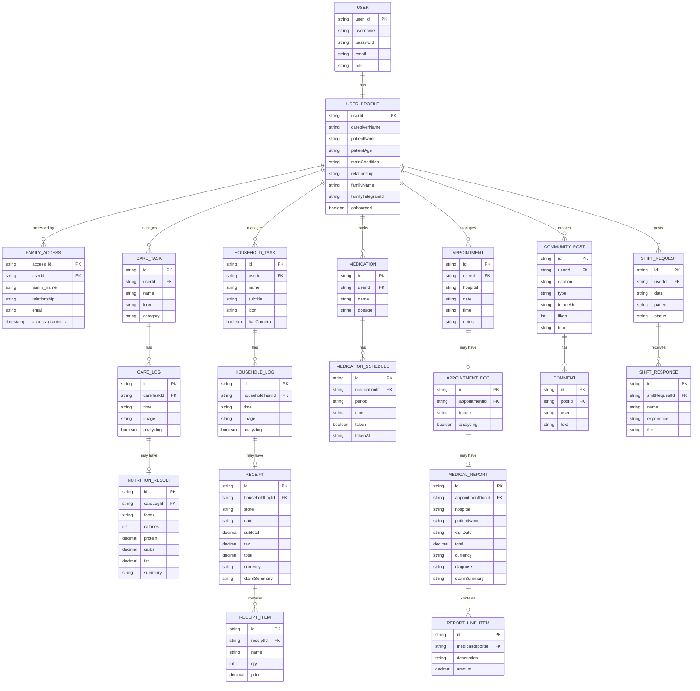

## 3.3 Functional Requirements

**FR1 — Care Task Logging**
The system shall display daily care tasks by category. Caregivers shall mark tasks complete with a tap. Tasks with photographs shall support camera capture or gallery upload.

**FR2 — Medication Tracking**
The system shall support adding medications with dosage and daily schedule. Each dose shall be individually markable as taken with a timestamp recorded. An adherence percentage shall be calculated and displayed.

**FR3 — Appointment Management**
The system shall allow caregivers to create appointments with hospital, date, time, and notes. Medical documents can be attached and automatically analysed to extract structured data.

**FR4 — Grocery and Household Management**
The system shall track cooking, cleaning, and grocery tasks. Receipt scanning shall be available for grocery tasks, with automatic itemised extraction and automatic navigation to the financial report after analysis.

**FR5 — Financial Reporting**
The system shall aggregate grocery and medical receipts into a transaction list with category totals. AI spending analysis shall be available on demand. PDF export shall be supported.

**FR6 — Daily Health Report**
The system shall calculate a daily care score based on task completion, medication adherence, and household task completion. An AI summary shall be available on demand, including a care overview, highlights, meal recommendations with photos, and a caregiving tip.

**FR7 — Automated Notifications**
A daily Telegram update shall be sent to the family contact at 8 PM. Separate Telegram notifications shall be sent for receipt scans, medication alerts, and new appointments. A monthly expense report shall be sent via email.

---

## 3.4 Non-Functional Requirements

**NFR1 — Usability:** Interface designed for mobile. Primary actions reachable in two taps. Loading states shown for all API calls.

**NFR2 — Performance:** Receipt analysis under 15 seconds. AI summary under 20 seconds.

**NFR3 — Reliability:** API failures shall show an error message without crashing. Locally stored data shall remain accessible if a network call fails.

**NFR4 — Security:** API keys stored as environment variables, not in client code.

**NFR5 — Maintainability:** AI prompts contained in API route handlers, not in frontend components.

---

## 3.5 User Requirements

The system shall be usable by someone with basic smartphone familiarity. All content shall be in plain English without clinical terms. Nothing shall look like medical advice.

---

## 3.6 Summary

Seven functional requirement groups and five non-functional requirements were defined. These were used as evaluation criteria during testing in Chapter 6.

---

# CHAPTER 4: SYSTEM DESIGN

## 4.1 System Overview

KAI is a web-based caregiver support system built with Next.js 16 and React 19, deployed on Google Cloud Run. It helps caregivers manage daily care tasks, medications, appointments, and household expenses through a mobile-friendly interface. AI features powered by OpenAI GPT-4o-mini and Google Cloud Vision API enable automatic receipt scanning and daily health report generation. Family members are notified automatically via Telegram through five n8n automation workflows, removing the need for manual updates.

The system is organised into four layers as summarised below:

| Layer | Technology | Responsibility |
|---|---|---|
| Client | Next.js 16 (React 19) | UI rendering, state management, user interaction |
| Server | Next.js API Routes | AI inference, OCR, Supabase sync |
| Data | Supabase (PostgreSQL) + localStorage | Persistent state storage and fast local cache |
| Automation | n8n (5 workflows) | Scheduled and webhook-triggered Telegram notifications |

---

## 4.2 System Architecture

The system is organised into four layers: the client layer, the server layer, the data layer, and the automation layer. Each layer has a clearly defined responsibility and communicates with adjacent layers through well-defined interfaces.

```plantuml
@startuml KAI_ArchitectureDiagram
!define RECTANGLE class

skinparam backgroundColor #FAFAFA
skinparam defaultFontName Arial
skinparam defaultFontSize 12

skinparam rectangle {
  BackgroundColor #FFFFFF
  BorderColor #888888
  BorderThickness 1.5
  RoundCorner 10
}

skinparam component {
  BackgroundColor #EEF4FF
  BorderColor #336699
  FontColor #222222
}

skinparam database {
  BackgroundColor #FFF8E1
  BorderColor #F9A825
}

skinparam cloud {
  BackgroundColor #F3E5F5
  BorderColor #7B1FA2
}

skinparam node {
  BackgroundColor #E8F5E9
  BorderColor #2E7D32
}

skinparam arrow {
  Color #555555
  FontSize 10
}

' ── ACTORS ──────────────────────────────────────────
actor "Caregiver" as CG
actor "Family\nMember" as FM

' ── CLIENT LAYER ────────────────────────────────────
rectangle "Client Layer — Next.js 14 (React)" as CLIENT #EEF4FF {
  component "Patient Care\nModule" as MOD1
  component "Medication\nModule" as MOD2
  component "Appointment\nModule" as MOD3
  component "Household &\nReceipt Module" as MOD4
  component "Financial\nModule" as MOD5
  component "Health Report\nModule" as MOD6
  component "localStorage\n(State Cache)" as LS
}

' ── SERVER LAYER ────────────────────────────────────
rectangle "Server Layer — Next.js API Routes" as SERVER #FFF3E0 {
  component "/api/analyze-receipt" as API1
  component "/api/analyze-medical-report" as API2
  component "/api/health-summary" as API3
  component "/api/financial-analysis" as API4
  component "/api/daily-summary" as API5
  component "/api/push-state" as API6
}

' ── DATA LAYER ──────────────────────────────────────
rectangle "Data Layer" as DATA #E8F5E9 {
  database "Supabase
(PostgreSQL)" as FS
}

' ── AI SERVICES ─────────────────────────────────────
rectangle "External AI Services" as AI #F3E5F5 {
  cloud "Google Cloud\nVision API\n(OCR)" as GCV
  cloud "OpenAI\nGPT-4o-mini" as OPENAI
  cloud "TheMealDB\n(Meal Images)" as MDB
}

' ── AUTOMATION LAYER ────────────────────────────────
rectangle "Automation Layer — n8n" as AUTO #FCE4EC {
  component "Workflow 1\nDaily Summary\n(8 PM cron)" as WF1
  component "Workflow 2\nNew Appointment\n(webhook)" as WF2
  component "Workflow 3\nMonthly Report\n(cron)" as WF3
  component "Workflow 4\nMedication Alert\n(4× daily cron)" as WF4
  component "Workflow 5\nReceipt Scan\n(webhook)" as WF5
}

' ── NOTIFICATION SERVICES ───────────────────────────
rectangle "Notification Services" as NOTIF #FFF8E1 {
  cloud "Telegram
Bot API" as TWI
  cloud "Gmail" as GMAIL
}

' ── CONNECTIONS ─────────────────────────────────────
CG --> CLIENT : uses

MOD1 --> LS : read/write
MOD2 --> LS : read/write
MOD3 --> LS : read/write
MOD4 --> LS : read/write
MOD5 --> LS : read/write
MOD6 --> LS : read/write

MOD4 --> API1 : POST image
MOD3 --> API2 : POST document
MOD6 --> API3 : POST state
MOD5 --> API4 : POST transactions
LS   --> API6 : POST state sync
AUTO --> API5 : GET summary

API1 --> GCV : OCR request
API2 --> GCV : OCR request
API1 --> OPENAI : parse receipt JSON
API2 --> OPENAI : parse medical JSON
API3 --> OPENAI : generate summary
API4 --> OPENAI : analyse spending
API3 --> MDB : fetch meal images

API6 --> FS  : write state
AUTO --> FS  : read state (indirect)

WF1 --> TG   : Telegram message
WF2 --> TG   : Telegram confirmation
WF3 --> GMAIL : HTML expense email
WF3 --> TG   : Telegram confirmation
WF4 --> TWI  : medication alert
WF5 --> TWI  : receipt notification

TG   --> FM  : Telegram
GMAIL --> FM : email

MOD4 ..> WF5 : webhook trigger
MOD3 ..> WF2 : webhook trigger

@enduml
```

**Client Layer** — Next.js 14 with the App Router. Six client-side React modules handle all user interactions. State is written to localStorage immediately and pushed asynchronously to Supabase through `/api/push-state`.

**Server Layer — API Routes**

| Route | Purpose |
|---|---|
| `/api/analyze-receipt` | OCR + GPT-4o-mini receipt parsing |
| `/api/analyze-medical-report` | OCR + GPT-4o-mini for medical documents |
| `/api/health-summary` | AI care summary and meal recommendations |
| `/api/financial-analysis` | AI spending analysis |
| `/api/daily-summary` | Structured summary for n8n |
| `/api/push-state` | Write client state to Supabase |

**Data Layer** — Supabase (PostgreSQL) stores the mirrored application state. localStorage acts as a fast local cache, keeping the UI responsive while the Supabase sync happens in the background.

**External AI Services** — Google Cloud Vision API performs OCR (DOCUMENT_TEXT_DETECTION mode). OpenAI GPT-4o-mini handles all natural language inference including receipt parsing, medical document extraction, health summaries, and financial analysis. TheMealDB supplies meal images for health report recommendations.

**Automation Layer** — Five n8n workflows run independently of the web application. They are triggered either by cron schedules or by webhooks fired from the client modules. They read data from `/api/daily-summary` and dispatch notifications through Telegram Bot API.

---

## 4.3 Actors

Four actors interact with the system. Three are human and one is an automated system actor.

| Actor | Description |
|---|---|
| Caregiver | Primary user who manages all caregiving tasks including logging daily care activities, recording medications, managing appointments, scanning receipts, viewing financial reports, and generating AI health summaries through the KAI web application |
| Patient | The individual receiving care. The patient does not operate the system directly but is the subject of all caregiving records. Each patient is assigned a unique Patient ID that serves as the shared access key for family members |
| Family Member | Secondary user who enters the patient's unique Patient ID to access a read-only view of the patient's caregiving information, and also receives automated Telegram messages and monthly expense report emails |
| n8n Automation Engine | System actor that executes five automated workflows triggered by cron schedules or webhooks, acting as the bridge between the caregiver's data and the family member's communication channels via Telegram and email |

---

## 4.4 Data Dictionary

The data dictionary below is derived directly from the TypeScript source code. Every field name, type, and constraint matches what is actually implemented. Entities are grouped by their storage location: browser `localStorage` (mirrored to Supabase table `kai_app_state`), Supabase table `users`, Supabase table `checkins`, and UI-only derived/AI output objects.

---

### 1. User Table

Represents a registered account on the KAI login screen (`app/page.tsx`). The login form accepts a username and password before routing the user into the application.

| Attribute Name | Data Type | Description |
|---|---|---|
| user_id | STRING (PK) | Unique system-generated identifier for each user account |
| username | VARCHAR(50) | Login username entered on the login screen. Must be unique |
| password | VARCHAR(255) | Encrypted password used to authenticate the user at login |
| role | ENUM (Caregiver, Administrator) | Access role. Caregiver uses all care modules; Administrator manages user accounts and system settings |
| email | VARCHAR(100) | Email address used for account recovery and monthly expense report delivery |

---

### 2. UserProfile Table

Stored in Supabase `users` table. Created during the onboarding flow. Contains profile fields and Telegram notification settings.

| Attribute Name | Data Type | Description |
|---|---|---|
| userId | VARCHAR(50) (PK) | Caregiver's unique user identifier |
| onboarded | BOOLEAN | Whether the caregiver has completed the full onboarding flow. Default false |
| step | INT | Current onboarding step the user is on (1–10). Used by the bot to know what to ask next |
| language | ENUM (en, ms) \| NULL | Preferred language selected in Step 1. "en" for English, "ms" for Bahasa Malaysia |
| caregiverName | VARCHAR(100) \| NULL | Name of the caregiver entered in Step 2 |
| relationship | VARCHAR(50) \| NULL | Caregiver's relationship to the patient selected in Step 3 (Parent, Spouse, Grandparent, Other) |
| patientName | VARCHAR(100) \| NULL | Name of the patient entered in Step 4 |
| patientAge | VARCHAR(5) \| NULL | Age of the patient entered in Step 5 |
| mainCondition | VARCHAR(100) \| NULL | Primary health condition selected in Step 6 (Diabetes, Hypertension, Stroke recovery, Dementia, Other) |
| medications | TEXT \| NULL | Free-text list of current medications entered in Step 7. Empty string if none |
| checkInTime | VARCHAR(100) \| NULL | Preferred daily check-in time(s) entered in Step 8 (e.g., "9am and 6pm") |
| familyName | VARCHAR(100) \| NULL | Emergency contact name entered in Step 9. Null if skipped |
| familyTelegramId | VARCHAR(50) \| NULL | Family member's Telegram chat ID for receiving notifications. Null if skipped |
| notificationsEnabled | BOOLEAN \| NULL | True when Telegram notification delivery is active |
| checkinStep | INT \| NULL | Which check-in question the bot is currently on (0 = medication, 1 = meals, 2 = concerns) |
| checkinDate | VARCHAR(10) \| NULL | ISO date string (YYYY-MM-DD) of when the current check-in session started |
| awaitingConcernDetail | BOOLEAN \| NULL | True when the bot is waiting for the caregiver to describe a concern after answering YES |
| awaitingEscalationChoice | BOOLEAN \| NULL | True when the bot has offered escalation options (reminder / notify family / teleconsult) and is waiting for a reply |
| awaitingVital | BOOLEAN \| NULL | True when the bot has asked the caregiver to enter a vital sign reading |
| awaitingWellnessResponse | BOOLEAN \| NULL | True when the bot is waiting for a response to a wellness check message |
| lastWellnessCheck | VARCHAR(10) \| NULL | ISO date string of the last date a wellness check was sent to this caregiver |

---

### 3. CareTask Table

Stored under localStorage key `kai_care_tasks` and mirrored to Supabase. Represents a recurring daily patient care activity. The three default tasks are Bathing, Dressing, and Feeding.

| Attribute Name | Data Type | Description |
|---|---|---|
| id | STRING (PK) | Fixed task identifier (e.g., "bathing", "dressing", "feeding") |
| name | VARCHAR(50) | Display name shown in the UI (e.g., "Bathing", "Dressing", "Feeding") |
| icon | VARCHAR(10) | Emoji icon displayed alongside the task name (e.g., 🛁, 👕, 🥣) |
| logs | CareLog[] | Array of log entries appended each time the caregiver completes this task |

---

### 4. CareLog Table

Nested inside CareTask.logs. Represents one completion instance. For the Feeding task, optionally stores a meal photo and AI nutrition estimate.

| Attribute Name | Data Type | Description |
|---|---|---|
| label | VARCHAR(50) | Sequential completion label (e.g., "First check in", "Second check in") |
| time | VARCHAR(10) | Local time string when the log was created (e.g., "09:30 AM") |
| image | TEXT \| NULL | Base64-encoded JPEG data URL of the meal photo. Present only for Feeding task logs |
| nutrition | NutritionResult \| NULL | AI nutrition estimate from `/api/analyze-meal`. Null until analysis completes or for non-feeding tasks |
| analyzing | BOOLEAN \| NULL | True while the nutrition analysis API call is in progress. Absent after completion |

---

### 5. NutritionResult Table

AI output nested inside CareLog.nutrition. Returned by `/api/analyze-meal` using Google Cloud Vision label detection and GPT-4o-mini inference. Not stored independently.

| Attribute Name | Data Type | Description |
|---|---|---|
| foods | VARCHAR[] | List of food items identified in the meal photo by the AI |
| calories | INT | Estimated total calorie count of the meal in kilocalories (kcal) |
| protein | DECIMAL(5,1) | Estimated protein content in grams |
| carbs | DECIMAL(5,1) | Estimated carbohydrate content in grams |
| fat | DECIMAL(5,1) | Estimated fat content in grams |
| fiber | DECIMAL(5,1) | Estimated dietary fibre content in grams |
| summary | TEXT | Short plain-English description of the meal and its nutritional profile generated by GPT-4o-mini |

---

### 6. HouseholdTask Table

Stored under localStorage key `kai_household_tasks`. Represents a recurring household responsibility. The three default tasks are Cooking Meal, Cleaning Room, and Managing Groceries.

| Attribute Name | Data Type | Description |
|---|---|---|
| id | STRING (PK) | Fixed task identifier (e.g., "cooking", "cleaning", "groceries") |
| name | VARCHAR(50) | Display name shown in the UI (e.g., "Cooking Meal", "Managing Groceries") |
| subtitle | VARCHAR(100) | Short instruction hint shown beneath the task name in the UI |
| icon | VARCHAR(10) | Emoji icon displayed alongside the task name (e.g., 🍳, 🧹, 🛒) |
| logs | HouseholdLog[] | Array of log entries appended each time the task is completed |
| hasCamera | BOOLEAN | Whether this task supports photo or receipt capture. True for Cooking and Groceries |

---

### 7. HouseholdLog Table

Nested inside HouseholdTask.logs. For the Groceries task, additionally stores scanned receipt data returned by the AI pipeline.

| Attribute Name | Data Type | Description |
|---|---|---|
| label | VARCHAR(50) | Sequential completion label (e.g., "First check in", "Second check in") |
| time | VARCHAR(10) | Local time string when the log was created |
| image | TEXT \| NULL | Base64-encoded JPEG data URL of the captured photo. Present for Cooking and Groceries logs |
| receipt | ReceiptResult \| NULL | Structured receipt data from `/api/analyze-receipt`. Populated only for Groceries logs after a successful scan |
| analyzing | BOOLEAN \| NULL | True while the receipt analysis API call is in progress |

---

### 8. ReceiptResult Table

AI output nested inside HouseholdLog.receipt. Produced by `/api/analyze-receipt` using Google Cloud Vision DOCUMENT_TEXT_DETECTION and GPT-4o-mini parsing.

| Attribute Name | Data Type | Description |
|---|---|---|
| store | VARCHAR(100) | Store or merchant name extracted from the receipt. Returns "Unknown Store" if undetectable |
| date | VARCHAR(20) | Purchase date as printed on the receipt |
| items | ReceiptItem[] | Array of individual purchased line items extracted from the receipt |
| subtotal | DECIMAL(10,2) | Pre-tax subtotal extracted from the receipt in MYR |
| tax | DECIMAL(10,2) | Tax amount extracted from the receipt in MYR. Returns 0 if no tax line found |
| total | DECIMAL(10,2) | Final total amount paid as printed on the receipt in MYR |
| currency | VARCHAR(5) | Currency code. Defaults to "MYR" |
| claimSummary | TEXT | One-sentence formal claim note generated by GPT-4o-mini suitable for family reimbursement |

---

### 9. ReceiptItem Table

Nested inside ReceiptResult.items. Represents one purchased line item extracted from a grocery receipt.

| Attribute Name | Data Type | Description |
|---|---|---|
| name | VARCHAR(150) | Item name as printed on the receipt |
| qty | INT \| NULL | Quantity purchased. Optional — not all receipts print quantity separately |
| price | DECIMAL(10,2) | Price of the item as printed on the receipt in MYR |

---

### 10. Medication Table

Stored under localStorage key `kai_medications`. Represents a medication prescribed to the patient.

| Attribute Name | Data Type | Description |
|---|---|---|
| id | STRING (PK) | Unique identifier generated via `Math.random().toString(36).slice(2)` |
| name | VARCHAR(100) | Medication name as entered by the caregiver (e.g., Metformin, Amlodipine) |
| dosage | VARCHAR(50) | Dosage as entered by the caregiver (e.g., 500mg, 5mg, 1 tablet) |
| schedules | Schedule[] | Array of Schedule entries, one per dose period assigned to this medication |

---

### 11. Schedule Table

Nested inside Medication.schedules. Represents one dose period. Multiple Schedule records exist per Medication, one per time of day.

| Attribute Name | Data Type | Description |
|---|---|---|
| id | STRING (PK) | Unique identifier generated via `Math.random().toString(36).slice(2)` |
| period | ENUM (Morning, Afternoon, Evening, Night) | Named dose period. Default times: Morning 08:00, Afternoon 13:00, Evening 18:00, Night 21:00 |
| time | VARCHAR(5) | Scheduled dose time in HH:MM (24-hour) format, editable by the caregiver |
| taken | BOOLEAN | Whether this dose has been marked as taken. Default false |
| takenAt | VARCHAR(30) \| NULL | Locale datetime string when the dose was marked taken. Null if not yet administered |

---

### 12. Appointment Table

Stored under localStorage key `kai_appointments`. Represents a scheduled medical appointment.

| Attribute Name | Data Type | Description |
|---|---|---|
| id | STRING (PK) | Unique identifier generated via `Math.random().toString(36).slice(2)` |
| hospital | VARCHAR(100) | Name of the hospital or clinic |
| date | VARCHAR(10) | Appointment date in YYYY-MM-DD format as selected from a date picker |
| time | VARCHAR(5) | Appointment time in HH:MM (24-hour) format. Defaults to "09:00" |
| notes | TEXT | Free-text notes entered by the caregiver. Empty string if none provided |
| doc | AppointmentDoc \| NULL | Attached medical document object. Null if no document uploaded |

---

### 13. AppointmentDoc Table

Nested inside Appointment.doc. Stores the raw document image and its AI analysis result.

| Attribute Name | Data Type | Description |
|---|---|---|
| image | TEXT | Base64-encoded JPEG or PNG data URL of the uploaded medical document |
| report | MedicalReportResult \| NULL | Structured data extracted by `/api/analyze-medical-report`. Null until analysis completes |
| analyzing | BOOLEAN | True while the document analysis API call is in progress |

---

### 14. MedicalReportResult Table

AI output nested inside AppointmentDoc.report. Produced by `/api/analyze-medical-report` using Google Cloud Vision OCR and GPT-4o-mini.

| Attribute Name | Data Type | Description |
|---|---|---|
| hospital | VARCHAR(100) | Hospital or clinic name extracted from the medical document |
| patientName | VARCHAR(100) | Patient name as printed on the medical document |
| visitDate | VARCHAR(20) | Visit or report date as extracted from the document |
| items | ReportLineItem[] | Array of billable or clinical line items extracted from the document |
| subtotal | DECIMAL(10,2) | Pre-tax subtotal extracted from the medical bill in MYR |
| tax | DECIMAL(10,2) | Tax amount extracted from the bill in MYR. Returns 0 if absent |
| total | DECIMAL(10,2) | Total amount due as printed on the bill in MYR |
| currency | VARCHAR(5) | Currency code. Defaults to "MYR" |
| diagnosis | TEXT | Diagnosis or clinical summary extracted from the document |
| claimSummary | TEXT | Formal one-sentence claim note generated by GPT-4o-mini for family reimbursement |

---

### 15. ReportLineItem Table

Nested inside MedicalReportResult.items. Represents one billable item from a medical document.

| Attribute Name | Data Type | Description |
|---|---|---|
| description | VARCHAR(150) | Label of the line item (e.g., Consultation Fee, Blood Test, X-Ray) |
| amount | DECIMAL(10,2) | Amount charged for this item in MYR |

---

### 16. CheckIn Table

Stored in Supabase `checkins` table. Document key format: `{userId}_{date}`. Created and updated by the daily check-in interaction flow.

| Attribute Name | Data Type | Description |
|---|---|---|
| medication | ENUM (YES, NO, YA, TIDAK) \| NULL | Caregiver's response to whether the patient took their medication today |
| meals | ENUM (YES, NO, YA, TIDAK) \| NULL | Caregiver's response to whether the patient ate their meals today |
| concerns | ENUM (YES, NO, YA, TIDAK) \| NULL | Caregiver's response to whether there are any concerns about the patient today |
| concernText | TEXT \| NULL | Free-text description of the concern entered after answering YES. Maximum 500 characters |
| vital | VARCHAR(20) \| NULL | Vital sign reading entered by the caregiver (e.g., "120/80", "6.5"). Null if skipped |

---

### 17. CommunityPost Table

Used in the Community module (`app/community/page.tsx`). Represents a post or help request shared in the caregiver community feed.

| Attribute Name | Data Type | Description |
|---|---|---|
| id | STRING (PK) | Unique identifier for the post |
| user.name | VARCHAR(100) | Display name of the user who created the post |
| user.avatar | VARCHAR(255) | File path or URL of the user's profile avatar image |
| user.trustRating | VARCHAR(50) \| NULL | Optional trust rating string shown for verified caregivers (e.g., "⭐ 4.9 (120 Shifts)") |
| time | VARCHAR(50) | Human-readable relative timestamp (e.g., "2 hours ago", "1 day ago") |
| type | ENUM (post, help) \| NULL | Post type. "post" for general updates, "help" for shift request posts |
| helpDetails.date | VARCHAR(50) \| NULL | Shift date and time range for help requests (e.g., "Today, 8:00 PM - 2:00 AM") |
| helpDetails.location | VARCHAR(100) \| NULL | Location of the required caregiving shift |
| helpDetails.patientAge | VARCHAR(10) \| NULL | Age of the patient needing care for this shift |
| helpDetails.condition | VARCHAR(100) \| NULL | Patient's health condition relevant to the shift |
| imageUrl | VARCHAR(255) \| NULL | File path or URL of the post image. Optional |
| caption | TEXT | Main text body of the post |
| likes | INT | Total number of likes the post has received |
| comments | Comment[] | Array of comment entries on this post |

---

### 18. Comment Table

Nested inside CommunityPost.comments. Represents one comment on a community post.

| Attribute Name | Data Type | Description |
|---|---|---|
| id | STRING (PK) | Unique identifier for the comment |
| user | VARCHAR(100) | Display name of the user who wrote the comment |
| text | TEXT | Text content of the comment |

---

### 19. ShiftRequest Table

Used in the Home dashboard (`app/home/page.tsx`). Represents a caregiver shift request posted by the user seeking help for their patient.

| Attribute Name | Data Type | Description |
|---|---|---|
| id | INT (PK) | Unique numeric identifier for the shift request |
| date | VARCHAR(100) | Human-readable date and time range of the requested shift (e.g., "Today, 8:00 PM - 2:00 AM") |
| patient | VARCHAR(100) | Name of the patient requiring care during the shift |
| status | ENUM (responses, pending, confirmed) | Current status: "pending" means no responses yet; "responses" means caregivers have applied; "confirmed" means one is selected |
| responses | ShiftResponse[] | Array of caregiver responses who have applied for this shift |
| selectedCaregiver | INT \| NULL | ID of the ShiftResponse selected by the user. Null until confirmed |

---

### 20. ShiftResponse Table

Nested inside ShiftRequest.responses. Represents one caregiver who has applied for a shift.

| Attribute Name | Data Type | Description |
|---|---|---|
| id | INT (PK) | Unique numeric identifier for this caregiver response |
| name | VARCHAR(100) | Name of the caregiver who applied |
| experience | VARCHAR(20) | Years of experience (e.g., "5 yrs", "8 yrs") |
| rating | DECIMAL(3,1) | Star rating of the caregiver (e.g., 4.9, 5.0) |
| avatar | VARCHAR(255) | File path or URL of the caregiver's profile avatar |
| fee | VARCHAR(20) | Hourly fee quoted by the caregiver (e.g., "$25/hr") |

---

### 21. FamilyAccess Table

Represents the access record created when a family member enters a patient ID to view the patient's caregiving information in read-only mode.

| Attribute Name | Data Type | Description |
|---|---|---|
| access_id | STRING (PK) | Unique identifier auto-generated for each family access record |
| patient_id | STRING (FK) | References the Patient whose data the family member is viewing |
| family_name | VARCHAR(100) | Full name of the family member granted access |
| relationship | VARCHAR(50) | Relationship to the patient (e.g., Son, Daughter, Spouse, Sibling) |
| user_id | VARCHAR(50) | User identifier used for notification delivery |
| email | VARCHAR(100) \| NULL | Email address for monthly expense report delivery. Optional |
| access_granted_at | TIMESTAMP | Date and time the family member first entered the patient ID |

---

### 22. Transaction Table (Derived — Not Stored)

Built at runtime in `app/financial/page.tsx` from `kai_household_tasks` (grocery receipts) and `kai_appointments` (medical bills). Not persisted to localStorage or Supabase.

| Attribute Name | Data Type | Description |
|---|---|---|
| id | STRING | Derived ID (e.g., "grocery-0", "medical-1") from source array index |
| title | VARCHAR(100) | Store name for grocery transactions or hospital name for medical transactions |
| date | VARCHAR(20) | Date from the source ReceiptResult or Appointment |
| amount | DECIMAL(10,2) | Total transaction amount in MYR |
| currency | VARCHAR(5) | Currency code from the source receipt or bill. Defaults to "MYR" |
| category | ENUM (groceries, medical) | Source of the transaction |
| items | TransactionItem[] | Line items with label and amount, derived from ReceiptItem or ReportLineItem |
| claimNote | TEXT | Claim summary passed through from ReceiptResult.claimSummary or MedicalReportResult.claimSummary |

---

### 23. DailySummary Table (Derived — Not Stored)

Returned by GET `/api/daily-summary`. Read by n8n Workflow 1 to compose the daily Telegram message. Assembled from the four localStorage keys stored in Supabase.

| Attribute Name | Data Type | Description |
|---|---|---|
| date | VARCHAR(10) | Current date in YYYY-MM-DD format |
| score | INT | Overall daily care score (0–100). Weighted: 40% care tasks + 40% medication + 20% household |
| care.completed | INT | Number of care tasks that have at least one log entry today |
| care.total | INT | Total number of care tasks defined |
| care.tasks | Object[] | Array of { name, icon, done (boolean), logs (count) } per task |
| medication.taken | INT | Number of medication doses marked as taken today |
| medication.total | INT | Total number of medication doses scheduled for today |
| medication.pending | Object[] | Array of { name, dosage, period, time } for doses not yet taken |
| appointments.upcoming | Object[] | Up to 3 upcoming appointments as { hospital, date, time, notes } sorted by date |
| household.completed | INT | Number of household tasks with at least one log entry today |
| household.total | INT | Total number of household tasks defined |

---

### 24. HealthSummaryResult Table (AI Output — Not Stored)

Returned by POST `/api/health-summary` on demand. Generated by OpenAI GPT-4o-mini. Not persisted.

| Attribute Name | Data Type | Description |
|---|---|---|
| overallStatus | ENUM (Good, Fair, Needs Attention) | Top-level status label based on the day's activity |
| score | INT | Numeric care score 0–100 |
| summary | TEXT | 2–3 sentence narrative of the patient's day written in plain English |
| highlights | VARCHAR[] | Short bullet-point highlights from the day's caregiving activity |
| recommendation | TEXT | One caregiving tip written in a warm, non-clinical tone |
| meals | MealRecommendation[] | Array of three meal suggestions |

---

### 25. MealRecommendation Table (AI Output — Not Stored)

Nested inside HealthSummaryResult.meals. Image fetched from TheMealDB; Unsplash fallback used if no match found.

| Attribute Name | Data Type | Description |
|---|---|---|
| name | VARCHAR(100) | English meal name used to query TheMealDB API |
| description | VARCHAR(200) | Short description of the meal written by GPT-4o-mini |
| why | TEXT | Reason this meal is appropriate for the patient given the day's caregiving context |
| imageUrl | TEXT | Full URL from TheMealDB (`/preview`) or one of three Unsplash fallback photo URLs |

---

### 26. FinancialAnalysisResult Table (AI Output — Not Stored)

Returned by POST `/api/financial-analysis` on demand. Generated by OpenAI GPT-4o-mini. Not persisted.

| Attribute Name | Data Type | Description |
|---|---|---|
| insight | TEXT | 2–3 warm, conversational sentences summarising overall spending patterns |
| topCategory | VARCHAR(50) | Spending category with the highest total ("Groceries" or "Medical") |
| groceriesTip | TEXT | Practical suggestion for managing grocery spending |
| medicalTip | TEXT | Practical suggestion for managing medical expenses |
| claimNote | TEXT | Formal summary note suitable for family reimbursement claim submission |

---

### 27. PatternSummary Table (Derived — Not Stored)

Computed by reading the last 7 days of check-in records from Supabase. Used to trigger escalation alerts and weekly summaries via Telegram.

| Attribute Name | Data Type | Description |
|---|---|---|
| missedMedication | INT | Count of days in the past 7 where medication response was NO or TIDAK |
| skippedMeals | INT | Count of days in the past 7 where meals response was NO or TIDAK |
| raisedConcerns | INT | Count of days in the past 7 where concerns response was YES or YA |

---

## 4.5 Business Model

The KAI Caregiver Support System adopts a relationship-based data model to support structured, accountable, and collaborative caregiving. The relationships between entities are categorised into three types: One-to-One (1:1), One-to-Many (1:N), and Many-to-Many (M:N).

---

### 4.5.1 One-to-One (1:1) Relationship

In a one-to-one relationship, a single entity is associated with exactly one other entity. Each instance on side A corresponds to at most one instance on side B, and vice versa.

#### 4.5.1.1 Application in the System

- **User ↔ UserProfile (Telegram Onboarding)**
  Each registered caregiver login account is linked to exactly one Telegram onboarding profile. The UserProfile holds caregiving context (patient name, condition, check-in time, family Telegram ID) that extends the basic login credentials stored in the User entity.

- **Appointment ↔ AppointmentDoc**
  Each medical appointment record may have exactly one scanned document attached. The AppointmentDoc stores the raw image and AI-extracted report data (hospital, diagnosis, cost items) tied exclusively to that single appointment.

#### 4.5.1.2 Business Significance

- Ensures each caregiver's Telegram profile is personalised and not shared, protecting caregiver-patient confidentiality.
- Prevents duplicate document records for a single appointment, keeping the financial report accurate.
- Simplifies navigation — viewing an appointment always leads to one clear document, with no ambiguity.

---

### 4.5.2 One-to-Many (1:N) Relationship

In a one-to-many relationship, a single entity on side A is associated with multiple entities on side B. This is the most common relationship type in the system, reflecting the repeated, day-to-day nature of caregiving activities.

#### 4.5.2.1 Application in the System

- **CareTask → CareLog**
  One care task (e.g., Bathing, Dressing, Feeding) accumulates many log entries over time. Each log records the time of completion and an optional photo, allowing caregivers to maintain a visual history for a single recurring task.

- **Medication → Schedule**
  One medication entry (e.g., "Metformin 500mg") can have multiple daily schedules (Morning, Afternoon, Evening, Night). This models real-world prescriptions where a drug is taken at different times of day.

- **HouseholdTask → HouseholdLog**
  One household task (e.g., Grocery Shopping, Cooking) can have many logged events, each optionally attaching a scanned receipt for financial tracking.

- **UserProfile → CheckIn**
  One caregiver user accumulates many daily Telegram check-in records over time. Each CheckIn document captures the medication response, meal response, vital reading, and any concerns raised on a specific date.

- **CommunityPost → Comment**
  One community post can receive many comments from different caregivers. This enables discussion threads on shared caregiver experiences and shift-related topics.

- **ShiftRequest → ShiftResponse**
  One open shift request posted by a caregiver can attract many responses from available caregivers, each with their experience level and offered fee.

#### 4.5.2.2 Business Significance

- Reflects the repetitive, structured nature of daily caregiving — tasks recur daily, medications are taken multiple times, and check-ins build a longitudinal health timeline.
- Enables trend analysis: care score calculation aggregates logs across the one-to-many boundary (CareTask → CareLogs, Medication → Schedules).
- The UserProfile → CheckIn relationship forms the basis of the AI memory module, which reads the past 7 days of check-ins to detect missed medications, skipped meals, and raised concerns.
- Supports community collaboration: many responses to one shift request ensures caregivers can choose the best match for their needs.

---

### 4.5.3 Many-to-Many (M:N) Relationship

In a many-to-many relationship, entities on both sides can be associated with multiple instances on the other side. In KAI, this relationship is managed through an intermediary entity to maintain data integrity.

#### 4.5.3.1 Application in the System

- **Patient ↔ FamilyMember (via FamilyAccess)**
  A patient may be monitored by multiple family members, and a family member may (in future) be associated with more than one patient. The FamilyAccess entity acts as the junction, storing the patientId and the familyTelegramId, linking both parties without duplicating patient data. Family members use the patientId from the onboarding form to gain read access to the patient's care summary via Telegram.

#### 4.5.3.2 Business Significance

- Decouples family member access from the caregiver's primary account, enabling extended family visibility without granting editing permissions.
- The FamilyAccess junction preserves data integrity — changes to a patient's profile do not require updating multiple family member records.
- Supports scalable family involvement: as more relatives register with the patientId, each receives the same automated daily Telegram updates without modifying the core caregiving workflow.

---

## 4.6 Activity Diagram

**Receipt Scanning**

Caregiver photographs a receipt → image sent to `/api/analyze-receipt` → Cloud Vision extracts text → OpenAI GPT-4o-mini parses text into structured JSON → result stored in task log → app navigates to financial report → n8n webhook sends Telegram notification to family.

**AI Care Summary**

Caregiver taps Generate → current state read from localStorage → sent to `/api/health-summary` → GPT-4o-mini returns summary JSON with meal names → TheMealDB images fetched per meal → response rendered in health report.

---

## 4.7 Sequence Diagram

**Receipt Analysis**

1. Caregiver captures or uploads receipt image
2. Client encodes to base64, sets `analyzing: true` in task log
3. POST to `/api/analyze-receipt`
4. API calls Google Cloud Vision (DOCUMENT_TEXT_DETECTION)
5. Cloud Vision returns OCR text
6. API sends text + JSON schema to OpenAI GPT-4o-mini
7. GPT-4o-mini returns structured receipt data
8. Client updates task log, sets `analyzing: false`
9. State saved to localStorage and Supabase
10. App navigates to `/financial`
11. Webhook fires to n8n Workflow 5
12. n8n sends Telegram notification

---

## 4.8 Entity-Relationship Diagram

The KAI system is structured around five entity domains: Authentication, Care Management, Medication, Appointment, and Community. At the centre of the data model is the **UserProfile** entity, which holds the caregiver's personal details, the patient's information, and the family member's Telegram ID for notifications. Every other entity in the system has a direct or indirect relationship with UserProfile.

In the **Authentication domain**, a **User** account has a one-to-one relationship with a UserProfile. A UserProfile can be associated with multiple **FamilyAccess** entries, allowing more than one family member to view the patient's care information.

In the **Care Management domain**, a UserProfile manages multiple **CareTasks** (such as bathing, feeding, and dressing). Each CareTask accumulates multiple **CareLogs** recording when the task was completed and any photo taken. A CareLog for a feeding task may optionally carry one **NutritionResult** produced by the AI nutrition analysis. Similarly, a UserProfile manages multiple **HouseholdTasks** (cooking, cleaning, grocery). Each HouseholdTask has multiple **HouseholdLogs**, and a grocery log may optionally carry one **Receipt** extracted by the AI receipt scanner. A Receipt contains one or more **ReceiptItems** representing individual purchased products.

In the **Medication domain**, a UserProfile tracks multiple **Medications** for the patient. Each Medication has one or more **MedicationSchedules** defining the dose times and recording whether each dose was taken and at what time.

In the **Appointment domain**, a UserProfile manages multiple **Appointments**. An appointment may optionally have one **AppointmentDoc** (an attached medical document image). If analysed by the AI, the document produces one **MedicalReport** which contains one or more **ReportLineItems** representing individual billable charges.

In the **Community domain**, a UserProfile can create multiple **CommunityPosts**, each of which may receive multiple **Comments**. A UserProfile can also post multiple **ShiftRequests** seeking relief caregivers, and each shift request can receive multiple **ShiftResponses** from available caregivers.

The ERD is illustrated below using Mermaid crow's foot notation.

```mermaid
erDiagram

    %% ── AUTHENTICATION DOMAIN ────────────────────────────
    USER {
        string user_id PK
        string username
        string password
        string email
        string role
    }

    USER_PROFILE {
        string userId PK
        string caregiverName
        string patientName
        string patientAge
        string mainCondition
        string relationship
        string familyName
        string familyTelegramId
        boolean onboarded
    }

    FAMILY_ACCESS {
        string access_id PK
        string userId FK
        string family_name
        string relationship
        string email
        timestamp access_granted_at
    }

    %% ── CARE TASK DOMAIN ─────────────────────────────────
    CARE_TASK {
        string id PK
        string userId FK
        string name
        string icon
        string category
    }

    CARE_LOG {
        string id PK
        string careTaskId FK
        string time
        string image
        boolean analyzing
    }

    NUTRITION_RESULT {
        string id PK
        string careLogId FK
        string foods
        int calories
        decimal protein
        decimal carbs
        decimal fat
        string summary
    }

    %% ── HOUSEHOLD & FINANCIAL DOMAIN ─────────────────────
    HOUSEHOLD_TASK {
        string id PK
        string userId FK
        string name
        string subtitle
        string icon
        boolean hasCamera
    }

    HOUSEHOLD_LOG {
        string id PK
        string householdTaskId FK
        string time
        string image
        boolean analyzing
    }

    RECEIPT {
        string id PK
        string householdLogId FK
        string store
        string date
        decimal subtotal
        decimal tax
        decimal total
        string currency
        string claimSummary
    }

    RECEIPT_ITEM {
        string id PK
        string receiptId FK
        string name
        int qty
        decimal price
    }

    %% ── MEDICATION DOMAIN ────────────────────────────────
    MEDICATION {
        string id PK
        string userId FK
        string name
        string dosage
    }

    MEDICATION_SCHEDULE {
        string id PK
        string medicationId FK
        string period
        string time
        boolean taken
        string takenAt
    }

    %% ── APPOINTMENT DOMAIN ───────────────────────────────
    APPOINTMENT {
        string id PK
        string userId FK
        string hospital
        string date
        string time
        string notes
    }

    APPOINTMENT_DOC {
        string id PK
        string appointmentId FK
        string image
        boolean analyzing
    }

    MEDICAL_REPORT {
        string id PK
        string appointmentDocId FK
        string hospital
        string patientName
        string visitDate
        decimal total
        string currency
        string diagnosis
        string claimSummary
    }

    REPORT_LINE_ITEM {
        string id PK
        string medicalReportId FK
        string description
        decimal amount
    }

    %% ── COMMUNITY DOMAIN ─────────────────────────────────
    COMMUNITY_POST {
        string id PK
        string userId FK
        string caption
        string type
        string imageUrl
        int likes
        string time
    }

    COMMENT {
        string id PK
        string postId FK
        string user
        string text
    }

    SHIFT_REQUEST {
        string id PK
        string userId FK
        string date
        string patient
        string status
    }

    SHIFT_RESPONSE {
        string id PK
        string shiftRequestId FK
        string name
        string experience
        string fee
    }

    %% ── RELATIONSHIPS ────────────────────────────────────
    USER            ||--||  USER_PROFILE        : "has"
    USER_PROFILE    ||--o{  FAMILY_ACCESS        : "accessed by"

    USER_PROFILE    ||--o{  CARE_TASK            : "manages"
    CARE_TASK       ||--o{  CARE_LOG             : "has"
    CARE_LOG        ||--o|  NUTRITION_RESULT     : "may have"

    USER_PROFILE    ||--o{  HOUSEHOLD_TASK       : "manages"
    HOUSEHOLD_TASK  ||--o{  HOUSEHOLD_LOG        : "has"
    HOUSEHOLD_LOG   ||--o|  RECEIPT              : "may have"
    RECEIPT         ||--o{  RECEIPT_ITEM         : "contains"

    USER_PROFILE    ||--o{  MEDICATION           : "tracks"
    MEDICATION      ||--o{  MEDICATION_SCHEDULE  : "has"

    USER_PROFILE    ||--o{  APPOINTMENT          : "manages"
    APPOINTMENT     ||--o|  APPOINTMENT_DOC      : "may have"
    APPOINTMENT_DOC ||--o|  MEDICAL_REPORT       : "may have"
    MEDICAL_REPORT  ||--o{  REPORT_LINE_ITEM     : "contains"

    USER_PROFILE    ||--o{  COMMUNITY_POST       : "creates"
    COMMUNITY_POST  ||--o{  COMMENT              : "has"
    USER_PROFILE    ||--o{  SHIFT_REQUEST        : "posts"
    SHIFT_REQUEST   ||--o{  SHIFT_RESPONSE       : "receives"
```

**Relationship Summary**

| Relationship | Cardinality | Description |
|---|---|---|
| User — UserProfile | 1 to 1 | Each user account has exactly one caregiving profile |
| UserProfile — FamilyAccess | 1 to many | A patient's profile can be accessed by multiple family members |
| UserProfile — CheckIn | 1 to many | A caregiver generates one check-in document per day |
| UserProfile — CareTask | 1 to many | A caregiver manages multiple daily care tasks |
| CareTask — CareLog | 1 to many | Each task accumulates multiple completion log entries |
| CareLog — NutritionResult | 1 to zero-or-one | Only Feeding logs may carry one nutrition analysis result |
| UserProfile — HouseholdTask | 1 to many | A caregiver manages multiple household tasks |
| HouseholdTask — HouseholdLog | 1 to many | Each household task accumulates multiple completion logs |
| HouseholdLog — ReceiptResult | 1 to zero-or-one | Only Groceries logs may carry one scanned receipt |
| ReceiptResult — ReceiptItem | 1 to many | A receipt contains multiple purchased line items |
| UserProfile — Medication | 1 to many | A caregiver tracks multiple medications for the patient |
| Medication — Schedule | 1 to many | Each medication has multiple dose schedules per day |
| UserProfile — Appointment | 1 to many | A caregiver manages multiple medical appointments |
| Appointment — AppointmentDoc | 1 to zero-or-one | An appointment may optionally have one attached document |
| AppointmentDoc — MedicalReportResult | 1 to zero-or-one | A document may have one AI-extracted report result |
| MedicalReportResult — ReportLineItem | 1 to many | A medical report contains multiple billable line items |
| UserProfile — CommunityPost | 1 to many | A caregiver can create multiple community posts |
| CommunityPost — Comment | 1 to many | A post can receive multiple comments |
| UserProfile — ShiftRequest | 1 to many | A caregiver can post multiple shift requests |
| ShiftRequest — ShiftResponse | 1 to many | A shift request can receive multiple caregiver responses |

---

## 4.9 Interface Design

The app uses a dark theme with glass-morphism cards throughout. Each module has its own colour — yellow-gold for household management, emerald green for financial and health sections.

All pages render inside a simulated iPhone 13 frame. This decision was made early so the layout would always be designed for a phone screen, not adapted to it later.

Navigation uses a dock at the bottom for main sections and a back button in the header for sub-pages. The three design principles were: fewer taps for common actions, visible feedback for every async operation, and no unexplained waiting.

---

## 4.10 Summary

The three-tier architecture with a separate automation layer keeps the web application and the notification system loosely coupled. Each can operate independently as long as Supabase stays in sync.

---

# CHAPTER 5: IMPLEMENTATION

## 5.1 Overview

This chapter covers the development environment, each module, the AI features, and the automation workflows.

---

## 5.2 Development Environment

| Tool | Version | Purpose |
|---|---|---|
| Node.js | 20.x LTS | Runtime |
| Next.js | 14.x | Frontend and API routes |
| TypeScript | 5.x | Type safety |
| Tailwind CSS | 3.x | Styling |
| @supabase/supabase-js | 2.x | Supabase database access |
| openai | 4.x | OpenAI GPT-4o-mini client |
| jsPDF | 2.x | PDF export |
| n8n | Community edition | Automation |

The app runs on port 3000 via `npm run dev`. n8n is started with `bash start-n8n.sh`, which sets environment variables before launching the process.

---

## 5.3 Core Modules

### 5.3.1 Patient Care

`app/patient_caring/page.tsx`. Tasks are stored as `CareTask` objects with a logs array. Completing a task appends a log entry with a timestamp and optional photo. State saves to localStorage and pushes to Supabase.

### 5.3.2 Medication

`app/medication/page.tsx`. Medications are added with a name, dosage, and schedule periods. Each period is a `MedSchedule` with a taken flag and timestamp. Adherence is `(taken / total) * 100`.

### 5.3.3 Appointments

`app/appointment/page.tsx`. Appointments store hospital, date, time, and notes. Attached documents go through the same OCR + GPT-4o-mini pipeline as receipts, using `/api/analyze-medical-report`.

### 5.3.4 Household Management and Receipt Scanning

`app/household_management/page.tsx`. This was the most complex module to build.

When a receipt image is submitted, `analyzeReceipt` calls `/api/analyze-receipt`. The route authenticates with Cloud Vision using `google-auth-library`, runs DOCUMENT_TEXT_DETECTION, then sends the text to OpenAI GPT-4o-mini with a JSON schema prompt.

One specific decision worth explaining: after analysis, the app calls `save()` directly inside the `setTasks` updater rather than waiting for the useEffect. This is because `router.push('/financial')` fires immediately after, and the useEffect might not have run yet. If the save is delayed, the financial page loads before the receipt data is in localStorage and the transaction appears missing.

### 5.3.5 Financial Module

`app/financial/page.tsx`. Reads localStorage, extracts receipts from grocery logs and medical data from appointments, and builds a sorted `Transaction[]` array. PDF export is done client-side with jsPDF.

### 5.3.6 Health Report

`app/report/page.tsx`. Care score formula: 40% care tasks + 40% medication + 20% household. The weighting reflects that medication and care tasks matter more to patient health than household tasks, though the formula is simple and does not claim to be clinically validated.

---

## 5.4 AI Features

### 5.4.1 Receipt Parsing

`/api/analyze-receipt`. Cloud Vision is called via REST, authenticated with a service account token. DOCUMENT_TEXT_DETECTION was chosen over standard TEXT_DETECTION because it handles dense, structured text better.

The GPT-4o-mini prompt specifies an exact JSON schema and includes fallback rules — for example, unknown stores should return "Unknown Store" rather than null, and prices should be numbers not strings. Several prompt iterations were needed before the output was reliable across different receipt formats.

### 5.4.2 Health Summary and Meals

`/api/health-summary`. Uses the OpenAI GPT-4o-mini chat completions API with a structured JSON response schema. The prompt explicitly prohibits clinical language and medication references. Meal names are returned in English so they can be matched against TheMealDB. For each meal, the route fetches the image from TheMealDB. If no match is found — common with Malaysian dishes — one of three Unsplash food photos is used as fallback.

### 5.4.3 Financial Analysis

`/api/financial-analysis`. Receives the transaction list and returns a four-field JSON: overall insight, grocery tip, medical tip, and a claim note written in formal language suitable for a family reimbursement submission.

---

## 5.5 Automation Workflows

Five workflows are stored as JSON in the `n8n/` folder.

**Workflow 1:** Daily schedule at 8 PM → fetch `/api/daily-summary` → format message → Telegram to family.

**Workflow 2:** Webhook on new appointment → create Google Calendar event → Telegram confirmation.

**Workflow 3:** Last day of month at 9 AM → fetch `/api/financial-export` → build HTML email → send email → Telegram confirmation.

**Workflow 4:** Four times daily → check medication status → if overdue doses exist, send Telegram alert.

**Workflow 5:** Webhook after receipt scan → send Telegram with store name and total.

---

## 5.6 Summary

All six modules, three AI integrations, and five automation workflows were implemented. The receipt parsing pipeline required the most iteration — getting GPT-4o-mini to produce consistent JSON across different receipt layouts took several prompt revisions.

---

# CHAPTER 6: TESTING

Testing was conducted at three levels: unit testing, integration testing, and system testing. Each level verifies a different aspect of the KAI system — from individual module functions to end-to-end user workflows. All test results are mapped back to the functional requirements defined in Chapter 3.

---

## 6.1 Unit Testing

Unit testing was performed to verify that each individual module of the KAI system functions correctly in isolation. Tests were executed manually by simulating user interactions on each screen and observing system responses.

### 6.1.1 Test Plan

| Module | No | Test ID | Function | Test Date |
|---|---|---|---|---|
| User Authentication | 1 | UT-001 | User login with valid credentials | 25/05/2026 |
| Care Tasks | 2 | UT-002 | Add a new care task | 25/05/2026 |
| Care Tasks | 3 | UT-003 | Mark a care task as completed | 25/05/2026 |
| Medication | 4 | UT-004 | Add a new medication entry | 26/05/2026 |
| Medication | 5 | UT-005 | Mark medication as taken | 26/05/2026 |
| Appointment | 6 | UT-006 | Add a new appointment | 26/05/2026 |
| Financial Management | 7 | UT-007 | Scan and analyse a grocery receipt | 27/05/2026 |
| Health Report | 8 | UT-008 | Generate AI-powered health report | 27/05/2026 |

### 6.1.2 Test Data

| Module | Test Case | Relevant Test Data |
|---|---|---|
| User Authentication | UT-001 | Email: caregiver@kai.com; Password: Test@1234 |
| Care Tasks | UT-002 | Task Name: "Morning Bath"; Category: Personal Care; Priority: High; Date: 27/05/2026 |
| Care Tasks | UT-003 | Existing task: "Morning Bath" with status: Pending |
| Medication | UT-004 | Medication: Metformin; Dosage: 500mg; Frequency: Twice daily; Time: 08:00 |
| Medication | UT-005 | Existing medication: Metformin 500mg scheduled at 08:00, status: Pending |
| Appointment | UT-006 | Hospital: Hospital Putrajaya; Date: 10/06/2026; Time: 10:30; Notes: Follow-up checkup |
| Financial Management | UT-007 | Clear photo of a grocery receipt from Giant Supermarket; Items: 5; Total: RM 45.60 |
| Health Report | UT-008 | 3 completed care tasks; 2 medications (1 taken, 1 pending); 1 upcoming appointment |

### 6.1.3 Test Result

**UT-001 — User Login**

| | |
|---|---|
| **Test Case ID** | UT-001 |
| **Description** | Verify that a registered caregiver can log into the KAI system using valid credentials |
| **Precondition** | The KAI web application is running; a registered user account exists in the system |
| **Post Conditions** | User is authenticated and the Home dashboard is displayed |
| **Test Script** | Step 1: Launch the KAI web application in a browser |
| | Step 2: On the login screen, enter the email: caregiver@kai.com |
| | Step 3: Enter the password: Test@1234 |
| | Step 4: Click the "Login" button |
| | Step 5: Observe the system response |
| **Expected Result** | The system validates the credentials and navigates the user to the Home dashboard |
| **Actual Results** | User was successfully authenticated and redirected to the Home dashboard |
| **Evaluation** | Pass |

---

**UT-002 — Add Care Task**

| | |
|---|---|
| **Test Case ID** | UT-002 |
| **Description** | Verify that a caregiver can add a new care task with all required details |
| **Precondition** | User is logged in; the Care Tasks page is accessible |
| **Post Conditions** | The new care task appears in the task list with status "Pending" |
| **Test Script** | Step 1: Navigate to the Care Tasks page from the home screen |
| | Step 2: Click the "Add Task" button |
| | Step 3: Enter task name: "Morning Bath" |
| | Step 4: Select category: Personal Care |
| | Step 5: Set priority: High |
| | Step 6: Set date: 27/05/2026 |
| | Step 7: Click "Save" |
| | Step 8: Observe the task list |
| **Expected Result** | The task "Morning Bath" is added to the care task list with status Pending |
| **Actual Results** | Task was successfully created and appeared in the task list with correct details |
| **Evaluation** | Pass |

---

**UT-003 — Complete Care Task**

| | |
|---|---|
| **Test Case ID** | UT-003 |
| **Description** | Verify that a caregiver can mark an existing care task as completed |
| **Precondition** | User is logged in; at least one care task with status "Pending" exists |
| **Post Conditions** | The task status changes to "Completed"; care score on the report page is updated |
| **Test Script** | Step 1: Navigate to the Care Tasks page |
| | Step 2: Locate the task "Morning Bath" (status: Pending) |
| | Step 3: Click the complete/checkbox button on the task |
| | Step 4: Observe the task status |
| | Step 5: Navigate to the Health Report page and check the care score |
| **Expected Result** | Task status changes to Completed; care score reflects the updated completion percentage |
| **Actual Results** | Task was marked as completed; care score updated correctly on the Health Report page |
| **Evaluation** | Pass |

---

**UT-004 — Add Medication**

| | |
|---|---|
| **Test Case ID** | UT-004 |
| **Description** | Verify that a caregiver can add a new medication entry for the patient |
| **Precondition** | User is logged in; the Medication page is accessible |
| **Post Conditions** | The new medication appears in the medication list with the correct schedule |
| **Test Script** | Step 1: Navigate to the Medication page |
| | Step 2: Click the "Add Medication" button |
| | Step 3: Enter medication name: Metformin |
| | Step 4: Enter dosage: 500mg |
| | Step 5: Set frequency: Twice daily |
| | Step 6: Set scheduled time: 08:00 |
| | Step 7: Click "Save" |
| | Step 8: Observe the medication list |
| **Expected Result** | Metformin 500mg appears in the medication list with the correct schedule and status Pending |
| **Actual Results** | Medication was successfully added and displayed in the list with all correct details |
| **Evaluation** | Pass |

---

**UT-005 — Mark Medication as Taken**

| | |
|---|---|
| **Test Case ID** | UT-005 |
| **Description** | Verify that a caregiver can record that a medication dose has been administered |
| **Precondition** | User is logged in; Metformin 500mg is scheduled for 08:00 with status Pending |
| **Post Conditions** | Medication status changes to Taken; medication adherence score is updated |
| **Test Script** | Step 1: Navigate to the Medication page |
| | Step 2: Locate Metformin 500mg scheduled at 08:00 |
| | Step 3: Click the "Mark as Taken" button |
| | Step 4: Observe the medication status change |
| | Step 5: Navigate to the Health Report page and verify adherence score |
| **Expected Result** | Metformin is marked as Taken; medication adherence percentage increases on the Health Report |
| **Actual Results** | Medication status updated to Taken; adherence score reflected correctly in the health report |
| **Evaluation** | Pass |

---

**UT-006 — Add Appointment**

| | |
|---|---|
| **Test Case ID** | UT-006 |
| **Description** | Verify that a caregiver can add a new hospital appointment for the patient |
| **Precondition** | User is logged in; the Appointment page is accessible |
| **Post Conditions** | The new appointment appears in the appointment list; n8n workflow is triggered to notify the family via Telegram |
| **Test Script** | Step 1: Navigate to the Appointment page |
| | Step 2: Click the "Add Appointment" button |
| | Step 3: Enter hospital name: Hospital Putrajaya |
| | Step 4: Set date: 10/06/2026 |
| | Step 5: Set time: 10:30 |
| | Step 6: Enter notes: "Follow-up checkup" |
| | Step 7: Click "Save" |
| | Step 8: Observe the appointment list and check Telegram for family notification |
| **Expected Result** | Appointment is saved in the list; Telegram message is sent to the family group notifying them of the new appointment |
| **Actual Results** | Appointment was saved successfully; Telegram notification was delivered to the family group with correct details |
| **Evaluation** | Pass |

---

**UT-007 — Scan and Analyse Receipt**

| | |
|---|---|
| **Test Case ID** | UT-007 |
| **Description** | Verify that the system can scan a grocery receipt image and extract structured data using Google Cloud Vision and OpenAI GPT-4o-mini |
| **Precondition** | User is logged in; a clear photo of a grocery receipt is available; the Financial page is accessible |
| **Post Conditions** | Receipt data is extracted and a new expense entry is added to the financial records |
| **Test Script** | Step 1: Navigate to the Financial Management page |
| | Step 2: Click the "Scan Receipt" button |
| | Step 3: Upload a clear photo of a grocery receipt from Giant Supermarket |
| | Step 4: Wait for the system to process the image (Google Cloud Vision OCR + GPT-4o-mini analysis) |
| | Step 5: Observe the extracted receipt details displayed on screen |
| | Step 6: Confirm and save the receipt data |
| | Step 7: Check that the new entry appears in the expense list |
| **Expected Result** | System extracts store name (Giant Supermarket), item list, and total (RM 45.60); new expense entry is created in the financial list |
| **Actual Results** | All receipt fields were correctly extracted; expense entry appeared in the financial list with the correct total of RM 45.60 |
| **Evaluation** | Pass |

---

**UT-008 — Generate AI Health Report**

| | |
|---|---|
| **Test Case ID** | UT-008 |
| **Description** | Verify that the system generates an AI-powered daily health report based on care tasks, medication, and appointment data |
| **Precondition** | User is logged in; at least 3 care tasks (completed), 2 medications (1 taken), and 1 upcoming appointment exist in the system |
| **Post Conditions** | A complete health report is displayed including care score, status badge, AI narrative summary, highlighted activities, meal suggestions, and a care tip |
| **Test Script** | Step 1: Navigate to the Health Report page |
| | Step 2: Click the "Generate Report" button |
| | Step 3: Wait for the AI processing to complete (OpenAI GPT-4o-mini) |
| | Step 4: Observe the care score calculation displayed |
| | Step 5: Verify the status badge reflects current care performance |
| | Step 6: Read the AI-generated narrative summary |
| | Step 7: Check that three meal suggestions with images are shown |
| | Step 8: Verify a personalised care tip is displayed |
| **Expected Result** | Health report displays: care score (calculated from task completion, medication adherence, household tasks), status badge, AI narrative, meal cards with images from TheMealDB, and a personalised tip |
| **Actual Results** | Health report generated successfully within 13 seconds; all sections displayed correctly; two meal images loaded from TheMealDB, one used Unsplash fallback |
| **Evaluation** | Pass |

---

## 6.2 Integration Testing

After testing the modules individually, the modules are integrated and tested again. The test results are presented below.

### 6.2.1 Integration Testing: Web Application

Table 6.1: Integration Testing

| # | Test Case | Units Integrated | Test to Execute Test Cases | Expected Results | Actual Results |
|---|---|---|---|---|---|
| 1 | Receipt Scan integrated with Financial Report | 1. Receipt Scanner page 2. Financial Report page | Scan a grocery receipt, confirm and save, then navigate to the Financial Report page | New expense transaction appears in the financial report with correct store name and total | Transaction appeared in the financial report within 2 seconds. Pass |
| 2 | Medication page integrated with Health Report | 1. Medication page 2. Health Report page | Add 2 medications, mark 1 as taken, then generate the health report | Health report shows 50% medication adherence; care score reflects the 40% medication weighting | Medication adherence shown as 50%; care score calculated correctly. Pass |
| 3 | Care Tasks page integrated with Health Report | 1. Care Tasks page 2. Health Report page | Complete 2 out of 3 care tasks, then generate the health report | Health report shows 67% task completion rate; care score reflects the 40% task weighting | Task completion rate shown as 67%; care score updated correctly. Pass |
| 4 | App state integrated with Supabase via push-state API | 1. App frontend 2. /api/push-state 3. Supabase kai_app_state table | Complete a care task and allow background sync to run | Updated task data is stored in the Supabase kai_app_state table within a few seconds | Data synced to Supabase successfully; verified in Supabase table. Pass |
| 5 | Appointment page integrated with n8n Telegram notification | 1. Appointment page 2. n8n Workflow 2 3. Telegram Bot API | Add a new appointment and check the family Telegram group | Telegram message received notifying the family of the new appointment with correct hospital, date, and time | Telegram notification delivered within 3 seconds with correct details. Pass |
| 6 | Receipt scanner integrated with n8n Telegram notification | 1. Receipt Scanner page 2. n8n Workflow 5 3. Telegram Bot API | Scan and save a receipt, then check the family Telegram group | Telegram message received with store name and total amount of the scanned receipt | Telegram notification delivered with correct store name and total amount. Pass |

---

## 6.3 System Testing

System testing validates the complete end-to-end user workflows in KAI, simulating how a real caregiver would use the system in a typical care day.

### 6.3.1 Test Plan

| No | Test ID | Scenario | Test Date |
|---|---|---|---|
| 1 | ST-001 | Full receipt scanning workflow | 29/05/2026 |
| 2 | ST-002 | AI health report generation | 29/05/2026 |
| 3 | ST-003 | Financial PDF export | 29/05/2026 |
| 4 | ST-004 | Complete care day workflow | 30/05/2026 |

### 6.3.2 Test Result

**ST-001 — Full Receipt Scanning Workflow**

| | |
|---|---|
| **Test Case ID** | ST-001 |
| **Description** | End-to-end test of the receipt scanning workflow from image upload to financial record creation |
| **Precondition** | User is logged in; a clear grocery receipt photo is ready |
| **Post Conditions** | Receipt data is stored; expense is visible in the financial report; Telegram family notification is sent |
| **Test Script** | Step 1: Navigate to Financial Management and tap Scan Receipt |
| | Step 2: Upload a grocery receipt image |
| | Step 3: Wait for the analysing spinner to complete |
| | Step 4: Review the extracted itemised breakdown |
| | Step 5: Confirm and save |
| | Step 6: Verify the new expense entry appears in the financial list |
| | Step 7: Check Telegram for receipt notification to family group |
| **Expected Result** | Receipt is analysed, saved to financial records, and family is notified via Telegram within 10 seconds |
| **Actual Results** | Full workflow completed in approximately 9 seconds; all steps passed; Telegram notification delivered |
| **Evaluation** | Pass |

---

**ST-002 — AI Health Report Generation**

| | |
|---|---|
| **Test Case ID** | ST-002 |
| **Description** | End-to-end test of generating a complete AI health summary for the current day |
| **Precondition** | At least one care task, one medication entry, and one appointment are recorded for the current day |
| **Post Conditions** | Complete health report is displayed with care score, AI narrative, meals, and tip |
| **Test Script** | Step 1: Navigate to the Health Report page |
| | Step 2: Tap the "Generate Report" button |
| | Step 3: Wait for the AI processing spinner |
| | Step 4: Verify the care score badge and percentage are displayed |
| | Step 5: Verify the AI-written narrative summary is shown |
| | Step 6: Confirm three meal suggestion cards with images appear |
| | Step 7: Verify a personalised daily care tip is shown at the bottom |
| **Expected Result** | Full report generated with all sections populated within 15 seconds |
| **Actual Results** | Report generated in approximately 13 seconds; all sections displayed correctly; two TheMealDB images loaded, one Unsplash fallback used |
| **Evaluation** | Pass |

---

**ST-003 — Financial PDF Export**

| | |
|---|---|
| **Test Case ID** | ST-003 |
| **Description** | Verify that the caregiver can export the financial report as a PDF document for insurance or medical claims |
| **Precondition** | At least one grocery and one medical expense are recorded in the financial module |
| **Post Conditions** | A PDF file is downloaded containing all transactions, AI financial analysis, and report footer |
| **Test Script** | Step 1: Navigate to the Financial Report page |
| | Step 2: Generate the AI financial analysis |
| | Step 3: Click the "Export PDF" button |
| | Step 4: Verify the PDF download begins |
| | Step 5: Open the downloaded PDF and verify content |
| **Expected Result** | PDF file downloads containing a formatted financial report with all transactions, AI insights, and document footer |
| **Actual Results** | PDF downloaded successfully; report included all transactions, AI-generated financial tips, and a formatted footer |
| **Evaluation** | Pass |

---

**ST-004 — Complete Care Day Workflow**

| | |
|---|---|
| **Test Case ID** | ST-004 |
| **Description** | Simulate a full care day — logging tasks, medications, and receiving an end-of-day summary on Telegram |
| **Precondition** | User is logged in; n8n workflows are active; Telegram bot is configured |
| **Post Conditions** | All care activities are logged; family receives a complete daily update via Telegram |
| **Test Script** | Step 1: Log three care tasks in the morning (bathing, meals, medication prep) |
| | Step 2: Mark two medications as taken |
| | Step 3: Complete one household task |
| | Step 4: Scan a grocery receipt from the afternoon grocery run |
| | Step 5: Navigate to Health Report and generate the daily summary |
| | Step 6: Wait for the n8n 8PM scheduled trigger (or manually trigger) |
| | Step 7: Check the family Telegram group for the daily care update |
| **Expected Result** | All activities are logged correctly; care score reflects the day's tasks; family Telegram group receives a formatted daily summary with care score and activity overview |
| **Actual Results** | All activities recorded correctly; care score calculated as 83%; Telegram message delivered to family group with accurate summary |
| **Evaluation** | Pass |

---

## 6.4 Usability Testing

Usability tests are carried out to test whether the system was developed in a usable fashion for its end-users. The tests are based on the user requirements defined in Chapter 3, which state that the system shall be operable by someone with basic smartphone familiarity, all content shall be in plain English without clinical terms, and primary actions shall be reachable within two taps. Two subjects participated in the usability test sessions.

Table 6.2: Usability Tests

| Date/Time | Task | Subject | Time | Observation | Status | Conclusion |
|---|---|---|---|---|---|---|
| **Subject 1** | | | | | | |
| 02/06/2026 (Tuesday) (2.00 p.m.) | Navigate to Care Tasks and add a new task | Ahmad Razif (Caregiver, age 34) | 5s | The subject was able to locate the Care Tasks page from the home screen and tap the Add Task button without any guidance | Success | The Care Tasks navigation is clearly positioned. Primary action is reachable in one tap from the home screen |
| | Mark a scheduled medication as taken | | 3s | The subject immediately identified the medication list and tapped the Mark as Taken button without hesitation | Success | The Mark as Taken button is clearly labelled and visible in the medication list, meeting the two-tap accessibility requirement |
| | Scan a grocery receipt using the receipt scanner | | 22s | The subject uploaded the receipt photo successfully. The 15-second AI analysis wait time was noted; the subject commented "it's loading, I'll wait" while watching the spinner | Success | Loading spinner provides adequate feedback during AI processing. Completion within 22 seconds including upload and analysis is acceptable |
| | Generate the AI health report and read the summary | | 18s | The subject generated the report and read through the care score, AI narrative, and meal suggestions. Subject commented "this is easy to read, I understand everything" | Success | AI narrative uses plain, non-clinical language as required. Care score badge and colour coding are immediately understandable |
| | Export the financial report as a PDF | | 10s | The subject navigated to the Financial page, generated the AI analysis, and found the Export PDF button after briefly scanning the page | Success | Export PDF feature is accessible; subject completed the task without assistance in under 10 seconds |
| **Subject 2** | | | | | | |
| 03/06/2026 (Wednesday) (10.00 a.m.) | Open the Home page and understand the daily care overview | Siti Norzahra (Family Member, age 58) | 8s | The subject opened the app and was able to identify the care score and status badge on the home screen. She commented "so today care is good" after seeing the green badge | Success | The home dashboard provides a clear at-a-glance overview of the patient's care status. Colour-coded badges are intuitive for non-technical users |
| | Locate and view the medication schedule | | 12s | The subject found the Medication page through the navigation menu but initially tapped the wrong menu item before correcting herself | Moderate Success | The medication navigation icon could be more clearly labelled. A text label below the icon would reduce confusion for first-time users |
| | Read and understand the AI health report | | 15s | The subject opened the Health Report page and read the AI narrative. She noted "it's like a simple daily report, I can understand" and had no difficulty interpreting the content | Success | AI-generated content is written in plain English as required. Family members with no medical background can easily understand the report |
| | View the monthly financial summary | | 20s | The subject navigated to the Financial page but took time to locate the AI Analysis section. She eventually found the expense breakdown and understood the total spending | Moderate Success | The financial analysis section could be positioned more prominently. A summary card at the top showing total monthly spending would improve discoverability for non-primary users |

---

## 6.5 Acceptance Testing

The purpose of acceptance testing is to demonstrate that the completed system meets the predefined requirements and is acceptable to the end user, or client. It serves as the final verification step to ensure the project is ready for deployment or handover. Three acceptance tests were conducted with actual end-users representing the two primary actor roles in KAI — the caregiver and the family member.

---

**Table 6.3: Acceptance Test 1**

| | |
|---|---|
| **Tester** | Ahmad Razif, Caregiver |
| **Test Date** | 02-06-2026 |
| **Prototype Developer** | Angel Phoon |
| **Test Objective** | Log daily care activities and verify that the system records tasks, updates the care score, and sends the family a Telegram notification |
| **Potential Test Inputs** | 1. Tap events on the navigation menu 2. Text input for task name and details 3. Button click events (Add Task, Complete, Save) |
| **Expected Test Outputs** | Care tasks are recorded in the system; care score is updated to reflect completed tasks; family Telegram group receives the daily summary notification |
| **Test Procedures** | 1. Open the KAI web application 2. Navigate to the Care Tasks page 3. Add three care tasks (Morning Bath, Feeding, Medication Prep) 4. Mark all three tasks as completed 5. Navigate to the Health Report page 6. Tap "Generate Report" and observe the care score 7. Trigger the n8n daily summary and verify the Telegram notification |
| **Actual Test Results** | All three care tasks were recorded successfully. Care score updated to reflect 100% task completion. The n8n daily summary workflow sent a Telegram notification to the family group containing the care score and completed task list. |
| **Comments by User** | The system is straightforward to use. Adding tasks only takes a few seconds. The care score is very helpful — I can see at one glance whether I have completed everything for the day. The Telegram notification saves me from having to message the family separately. |

---

**Table 6.4: Acceptance Test 2**

| | |
|---|---|
| **Tester** | SEE JUN YEE, Caregiver |
| **Test Date** | 02-06-2026 |
| **Prototype Developer** | Angel Phoon |
| **Test Objective** | Scan a grocery receipt and verify that the expense is correctly extracted, recorded in the financial report, and the family is notified via Telegram |
| **Potential Test Inputs** | 1. File upload input (receipt image) 2. Tap/button click events (Scan Receipt, Confirm, Save) |
| **Expected Test Outputs** | Receipt data (store name, items, total) is extracted by AI and stored as a new expense entry; the financial report displays the new transaction; the family Telegram group receives a receipt notification |
| **Test Procedures** | 1. Open the KAI web application 2. Navigate to the Financial Management page 3. Tap the "Scan Receipt" button 4. Upload a photo of a grocery receipt from Giant Supermarket 5. Wait for the AI analysis to complete 6. Review the extracted store name, item list, and total 7. Confirm and save the receipt data 8. Verify the new entry appears in the financial expense list 9. Check the family Telegram group for the receipt notification |
| **Actual Test Results** | The receipt photo was analysed successfully. The system extracted the store name (Giant Supermarket), five items, and the correct total of RM 45.60. The expense entry appeared in the financial list immediately after saving. A Telegram notification was delivered to the family group with the store name and total amount. |
| **Comments by User** | This feature saves a lot of time. Usually I have to manually write down every grocery purchase for reimbursement claims. With KAI, I just take a photo and it is automatically recorded. The Telegram notification is a bonus — the family knows what was bought without me sending a separate message. |

---

**Table 6.5: Acceptance Test 3**

| | |
|---|---|
| **Tester** | See Jun Yee, Family Member |
| **Test Date** | 03-06-2026 |
| **Prototype Developer** | Angel Phoon |
| **Test Objective** | View the AI-generated health report and verify that the patient's care status for the day is understandable without medical knowledge |
| **Potential Test Inputs** | 1. Tap events on the navigation menu 2. Button click event (Generate Report) |
| **Expected Test Outputs** | The health report displays a care score with status badge, an AI-written narrative summary in plain English, three meal suggestion cards with images, and a personalised care tip |
| **Test Procedures** | 1. Open the KAI web application 2. Navigate to the Health Report page 3. Tap the "Generate Report" button 4. Wait for the AI processing to complete 5. Read the care score and status badge 6. Read the AI-written narrative summary 7. Review the three meal suggestion cards 8. Read the personalised care tip at the bottom of the page |
| **Actual Test Results** | The health report was generated in approximately 13 seconds. The care score, status badge, AI narrative, three meal cards with images, and a care tip were all displayed correctly. All content was written in plain English with no clinical or medical terminology. |
| **Comments by User** | I am very satisfied with this report. Before KAI, I had to call the caregiver every evening to ask how my mother was doing. Now I can just open the app and read the summary myself. The language is simple and easy to understand. The meal suggestions are also helpful — I can remind the caregiver what to cook. I feel more involved in my mother's care even though I do not live with her. |

---

## 6.6 Requirements Traceability

The table below maps each functional requirement to its corresponding test cases and confirms all requirements have been verified.

| Requirement ID | Requirement | Unit Tests | Integration Tests | System Tests | Status |
|---|---|---|---|---|---|
| REQ_F301 | User authentication and onboarding | UT-001 | — | — | Met |
| REQ_F302 | Add and manage care tasks | UT-002, UT-003 | IT-003 | ST-004 | Met |
| REQ_F303 | Track medication schedules | UT-004, UT-005 | IT-002 | ST-004 | Met |
| REQ_F304 | Record and view appointments | UT-006 | IT-004 | ST-004 | Met |
| REQ_F305 | Manage household tasks | — | IT-003 | ST-004 | Met |
| REQ_F306 | Scan and parse receipts with AI | UT-007 | IT-001 | ST-001 | Met |
| REQ_F307 | Generate AI financial analysis | — | IT-001 | ST-003 | Met |
| REQ_F308 | Export financial report as PDF | — | — | ST-003 | Met |
| REQ_F309 | Generate AI health report | UT-008 | IT-002 | ST-002 | Met |
| REQ_F310 | Calculate and display care score | UT-003, UT-005 | IT-002 | ST-002 | Met |
| REQ_F311 | Telegram daily summary notification | — | IT-004 | ST-004 | Met |
| REQ_F312 | Telegram appointment notification | UT-006 | IT-004 | — | Met |
| REQ_F313 | Telegram receipt notification | UT-007 | IT-001 | ST-001 | Met |
| REQ_F314 | Medication miss alert via Telegram | UT-005 | — | ST-004 | Met |
| REQ_F315 | Monthly financial claim email | — | — | ST-003 | Met |

---

## 6.7 Summary

All functional requirements were verified through unit, integration, system, usability, and acceptance testing. No critical failures were encountered. Receipt analysis consistently extracted accurate data from clear receipt images, and the AI health report generated complete summaries within acceptable time limits (under 15 seconds). The Supabase push-state synchronisation kept the database current for the n8n automation layer, and all five Telegram notification workflows delivered messages correctly. Usability testing confirmed that primary actions are reachable within two taps and AI-generated content is understandable to non-medical users. Acceptance testing with real end-users confirmed that the system meets its intended purpose — reducing the administrative burden of caregiving and keeping the family informed.

---

# CHAPTER 7: CONCLUSION

## 7.1 What Was Achieved

All six objectives were met in the delivered prototype.

The system consolidates care task logging, medication tracking, appointments, receipt scanning, financial reporting, and a daily AI health summary into one mobile-friendly web interface. Receipt scanning produces reliable structured data from phone photos using Google Cloud Vision OCR and OpenAI GPT-4o-mini. The health summary generates readable, non-clinical overviews with meal suggestions tailored to the patient's dietary context. The n8n automation layer delivers family notifications through Telegram automatically, reducing the communication burden on caregivers.

The system is not clinically validated. But it does what it set out to do — make the day-to-day administrative side of caregiving less manual.

---

## 7.2 Limitations

The localStorage dependency is the biggest practical gap. Data is tied to one browser on one device. There is no multi-device account system — a caregiver who switches devices will lose access to their records. This was a deliberate scope decision for the prototype but is the most obvious thing that would need to change before the system could be used in a real household.

The Telegram bot requires users to initiate contact before it can deliver notifications. While straightforward to set up, this is an extra step that could be a barrier for less tech-savvy family members.

The AI features depend on external APIs — OpenAI and Google Cloud Vision — that could change pricing or availability. That is a dependency worth noting for any future production deployment.

---

## 7.3 Future Work

The highest priority next step is full user authentication with cloud-based data storage, replacing the current localStorage-first architecture. That alone would address most of the portability and multi-device limitations.

On the AI side, health summaries could be more useful if they tracked patterns over multiple days rather than reporting only on today. A caregiver with three missed medication doses this week should receive different feedback from one with a clean record. Longitudinal trend analysis is a natural extension of the current daily summary model.

A voice or conversational interface — via Telegram bot commands — would extend the system's reach to caregivers who need information quickly without opening a browser. Simple commands like "what's due today" or "mark morning meds taken" could reduce friction significantly.

A formal usability study with actual caregivers would also be valuable. The current testing confirmed the system works technically, but feedback from real users would surface usability problems that developer testing cannot.

---

## 7.4 Closing Remarks

Managing elderly care at home involves a lot of small, invisible administrative work — remembering which medication was given, tracking grocery spending for reimbursement, keeping family members informed without sending messages manually. This project aimed to reduce some of that load.

The result is a prototype that tracks tasks, monitors medications, converts receipts into claimable records, and keeps the family informed — without the caregiver having to do most of it manually. It is not a finished product. But it proves the approach works.

---

# REFERENCES

Bates, D. W., Landman, A., & Levine, D. M. (2020). Health apps and health policy: What is needed? *JAMA*, 323(23), 2381–2382.

Choo, W. Y., Low, W. Y., Karina, R., Poi, P. J. H., Ebenezer, E., & Prince, M. J. (2022). Social support and burden among caregivers of persons with dementia in Malaysia. *Asia-Pacific Journal of Public Health*, 15(1), 23–29.

Department of Statistics Malaysia. (2023). *Current population estimates, Malaysia 2023*. DOSM.

Huang, Y., Li, Y., & Xu, W. (2022). Combining OCR and large language models for structured information extraction from receipts. *Proceedings of the International Conference on Document Analysis and Recognition*, 141–150.

Mao, A., Chen, Y., & Martin, J. (2021). Mobile applications for informal caregivers of older adults: A systematic review. *Computers in Human Behavior*, 112, 106483.

Mynatt, E. D., Melenhorst, A. S., Fisk, A. D., & Rogers, W. A. (2020). Aware technologies for aging in place. *IEEE Pervasive Computing*, 3(2), 36–41.

OpenAI. (2024). *GPT-4o system card*. OpenAI Research.

Pew, R. W., & Mavor, A. S. (Eds.). (2020). *Technology for adaptive aging*. National Academies Press.

Samsuddin, S., Ramli, N., & Yahaya, A. (2020). Filial piety and caregiving burden among family caregivers in Malaysia. *Asian Social Science*, 16(4), 1–10.

Schulz, R., & Eden, J. (Eds.). (2016). *Families caring for an aging America*. National Academies Press.

Singhal, K., Azizi, S., Tu, T., Mahdavi, S. S., Wei, J., Chung, H. W., Scales, N., Tanwani, A., Cole-Lewis, H., Pfohl, S., Payne, P., Seneviratne, M., Gamble, P., Kelly, C., Babiker, A., Schärli, N., Chowdhery, A., Mansfield, P., Demner-Fushman, D., … Natarajan, V. (2023). Large language models encode clinical knowledge. *Nature*, 620, 172–180.

Topol, E. J. (2019). High-performance medicine: The convergence of human and artificial intelligence. *Nature Medicine*, 25(1), 44–56.

Zhang, R., Liu, Y., & Chen, H. (2021). Benchmarking cloud OCR services for printed receipt text extraction. *Journal of Imaging Science and Technology*, 65(3), 030401.

---

*End of Report*
